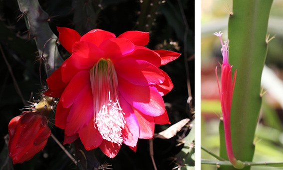

# **Comparative transcriptomics of flower development of *Disocactus* genus (Hylocereae, Cactaceae)**

---

## *Disocactus* background
 

*Disocactus* is an epiphytic cacti genus, principaly distribuited in Mexico but is also present in Central America. The genus is confomerd by 13 species, with constrastant flower morphology like: color hues, sizes, variation in number of perianth elements, and form (zygomorphic or actinomorphic). This characteristics make *Disocactus* a model genus to studie flower diversification in epiphytic cacti. [Phylogenetic studies made with cDNA](https://bioone.org/journals/willdenowia/volume-46/issue-1/wi.46.46112/Molecular-phylogeny-and-taxonomy-of-the-genus-iDisocactus-i-iCactaceae/10.3372/wi.46.46112.full) had shown that *Disocactus* is a monophyletic group member of [Hylocereeae tribe](https://www.researchgate.net/publication320829990_A_phylogenetic_framework_for_the_Hylocereeae_Cactaceae_and_implications_for_the_circumscription_of_the_genera) and sister to *Epiphyllum* and *Pseudorhipsalis* genus. 
 
In this project I used RNA-seq data from flowers buds of two different species of *Disocactus*: *D. speciosus* and *D. eichlamii* (Fig.1).  The flowers buds were collected from The Epiphytic Cacti Collection at [UNAM Botanical Garden](http://www.ib.unam.mx/jardin/) and from the Reserva del Pedregal de San Angel [(REPSA)](http://www.repsa.unam.mx/).The samples were processed at the Botanical Garden, UNAM and the RNA was sequenced at Beiging Genomic Center [(BGI)](BGI) in Hong Kong, China.Most of the bioinformatic analysis were made through Hercules cluster in Barcelona, Spain.  
 
In this repository you will find RNA-seq data from cacti flower buds of two species *Disocactus* genus: *D. speciosus* and *D. eichlamii* and scripts of  *de novo* assembly, annotation and differential expression analysis.

 

**Fig. 1.** flowers of *D. speciosus* and *D. eichlamii* in anthesis. Photos by Isaura Rosas Reinhold

 

---

### General objective

Identification of genetic expression patterns during flower development in two *Disocactus* species and its relation with morphologic diversity in the group.

#### Particular objectives  

**1.** *De novo* assembly and annotation of transcriptomes from two *Disocactus* species.

**2.** Determined and compare the genetic expression patterns in flower tissue and pericarpel tissue in every developmental stage.

**3.** Selection of genes involved in flower development for comparative transcriptomic analysis.

 

---
#### Data information

The data used in this proejct will be uploaded when the reasearch will be finished.

- The sequence platform used in this study was Illumina Hiseq4000
- The samples were secuenced to 2x150PE with a depth of 20M reads per sample.
The quality of the samples were evaluated with bioanalyzer. Samples with RIN (RNA Integrity Number) values  ⋝ 7 were sequenced while samples with RINA values ⋜ 7 were resequenced.
- 36 samples were sequenced. 18 for *D. echlamii* and 18 for *D. speciosus*
- *D.eichlamii* samples are divided in two: nine correspond to pericarpel tissue and the oher nine correspond to perianth tissue.
- *D.speciosus* samples are divided in two: nine correspond to pericarpel tissue and the oher nine correspond to perianth tissue.
- The code use to identify the samples are the following:

**NOTE**: All the samples independing if they correspond to RNA or they are anatomical samples conserved the same id code in order to facilitate the identification.

---
### Computational prerequisites

#### Operative system

- [Ubuntu 20.04.1 LTS](https://www.ubuntu.com/)

#### Software

- [Trimmomatic v0.32](http://www.usadellab.org/cms/?page=trimmomatic) 
- [fastQC](https://www.bioinformatics.babraham.ac.uk/projects/fastqc/) 
- [multiQC](https://multiqc.info/)
- [Trinity v2.4.0](https://github.com/trinityrnaseq/trinityrnaseq/wiki) 
- [Trinity v2.11.0](https://anaconda.org/bioconda/trinity)
- [Kallisto v0.43.0](https://pachterlab.github.io/kallisto)  
- [Kallisto v0.46.2](https://anaconda.org/bioconda/kallisto)
- [R v4.0.3](https://www.r-project.org/) 
- [Trinotate v3.1.1](https://github.com/Trinotate/Trinotate.github.io/wiki)
- [Transdecoder v5.5.0](https://github.com/TransDecoder/TransDecoder/wiki) 
- [BUSCO v4.1.4](https://busco.ezlab.org/busco_userguide.html)

#### R packages

- [DESeq2](https://bioconductor.org/packages/release/bioc/html/DESeq2.html) 
- [tidyverse](https://www.tidyverse.org/)
- [ggplot2](https://ggplot2.tidyverse.org/)
- [edgeR](https://bioconductor.org/packages/release/bioc/html/edgeR.html)
- [PCAtools](https://bioconductor.org/packages/release/bioc/html/PCAtools.html)
- [marray](https://www.bioconductor.org/packages/release/bioc/html/marray.html)
- [pheatmap](https://cran.r-project.org/web/packages/pheatmap/pheatmap.pdf)
- [tximport](https://bioconductor.org/packages/release/bioc/html/tximport.html)
- [rhdf5](bioconductor.org/packages/release/bioc/html/rhdf5.html)
- [dplyr]()
- [limma](https://bioconductor.org/packages/release/bioc/html/limma.html)

#### Other programs used in this research

- [gVolante](https://gvolante.riken.jp/)
- [Galaxy]()

 

---
### directories

 **[bin](/bin)**

Contains scripts used in thise project

**Note**
- `.r` scripts make in Rstudio
- `.sh`  scripts in bash leanguage
- `.R` functions

**Scripts list**

- `01.data_quality_test.sh` script to check the quality of raw reads using fastQC and multiQC
- `02.trimmomatic.sh` script to clean raw data using trimmomatic
- `03.check_quality_clean.sh`   script to check the quality of the clean data using fastQC and multiQC
- `04.gunzip.sh` script to unzip the clean data
- `05.fq_to_fa.sh`  script to convert fq data to fasta format
- `06.cat_samples.sh`  script to concatenate de fasta files
- `07.trinity_assembly` script to make de novo assembly using Trinity
- `08.kallisto_index.sh` script to crate de index used in kallisto analysis
- `09.Kallisto_quant.sh`  script to quantifie using kallisto program
- `10.DE_abun_est.sh` Script to stimate abundance in DE samples through trinity
- `11.DS_abun_est.sh` Script to stimate abundance in DS samples through trinity
- `12.count_expr_trans.sh` Script to count numbers of expressed transcripts in DS and DE
- `13.plot_num_transcripts.r`   Script to plot de number of transcripts, which use a perl function from [trinity](https://github.com/trinityrnaseq/trinityrnaseq/wiki).
- `14.quality_check_samples.sh` Script for quality check samples using trinity PtR Script
- `busco_figure.r` Script to create the BUSCO figure
- `dif_exp_DE.r`    Script to make differencial expression (DE) analysis using edgeR in D. eichalmii and create heatmaps and volcano plots
- `dif_exp_DS.r` Script to make DE analysis using edgeR in D. speciosus and create heatmap and volcano plots
- `functions.R` functions used in DE analysis
- `puntos_aleatorios.r`Script to add aleatorie point in epidermal cell photos
- `tepalos_graph.r` Script to analyze tepal cell grow in Disocactus species and produce graphics and statistics tables.

 

 **[data](/data)**  

Contains all the data used in the analysis.

**Note**: raw data, trinity assembly, among others are not included in this repo because of the size.

- `measurements` folder wich contains epidermal cell sizes organized in two different folders: 1) `DE` folder and 2) `DS` folder

**[meta](/meta)** 

Constains information about samples.  

- `Diso_code.csv` Table with information about the RNA sequentiation. The colomn names included in the table are the following: **species** (*D. speciosus* or *D. eichlamii*),	**stage** (developmental stage from 1-3),	**flower number** (number of the flower collected),	**tissue** (type of tissue sequenced, that coud be pericarpel (PC) or perianth (PA)),	**Sample code** (code asigned to the sample),	**RNA-sample** (code for the RNA sample),	**Concentración(ng/ul)**,	**OD260/280**,	**OD260/230**,	**RIN	28S/18S** (RNA integrity number).

- `sample_size.csv` Table with information about developmental stage and flower sizes collected. The colomns names included in the table are the following: **species** (species name),	**stage** (developmental stage),	**Sample code** (code use to identify the flower samples),	**flower size** (in cm).

- `samples.txt` Table with information used in Diferencial Expression analysis. The table colomns names are the followin: **sample_name**, **sample_replicate_name tissue** (the name assigned for the kallisto analysis),     **tissue** (pericarpel or perianth) and    **development_stage** (from 1-3).

**[figures](/figures)**

In this folder you will find figures and photographies used to illustrate the project.

**[project_info](/project_info)**

 - `Disocactus_project.md` contains project extra information like: species distribution, samples, RNA extraction methodology, etc.
 - `supertranscripts.md` contais info about supertranscripts methodology

**[out](/out)**  

Contains results of all analysis made in the research

- `BUSCO_summaries` contains BUSCO out data and plot
- `tepal_sizes` graphics and tables related to cell sizes statistics analysis in different developmental stages.
- `dif_exp_DS` contains results from differential expression analysis made with edgeR for *D. speciosus* specie.
- `dif_exp_DE` contains results from differential expression analysis made with edgeR for *D. eichalmii* specie.

**Credits:**

* **Isaura Rosas Reinhold**

**License**
