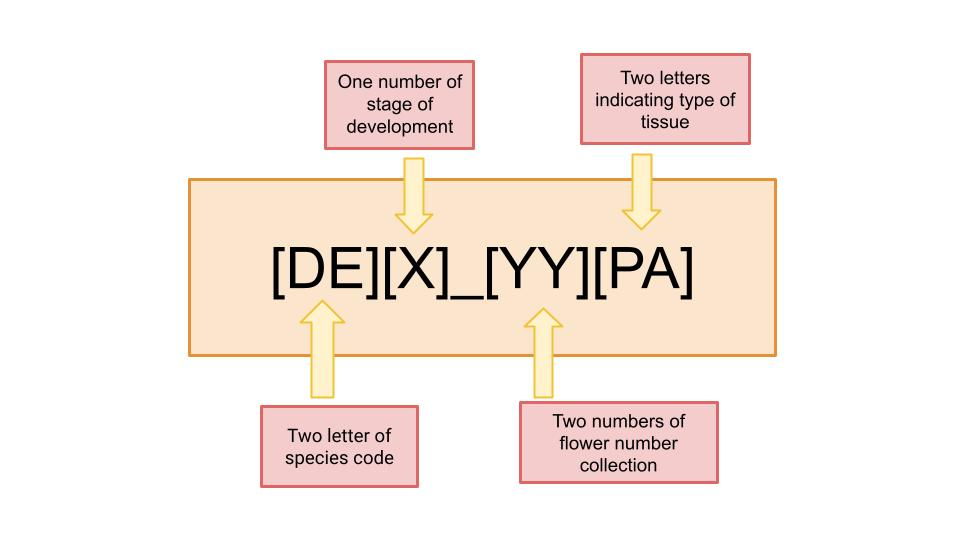
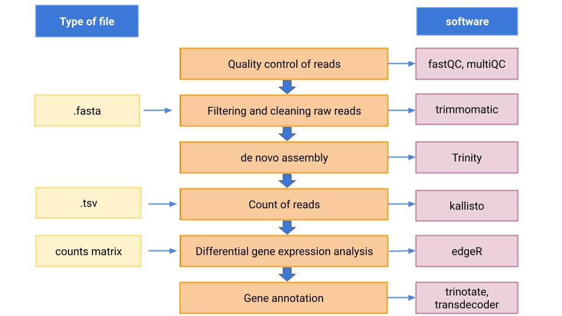

# **Comparative transcriptomics of flower development of *Disocactus* genus (Hylocereae, Cactaceae)**

---

## *Disocactus* background
 

*Disocactus* is an epiphytic cacti genus, mainly distribuited in Mexico, also spread in Central America. The genus is composed by 13 species with constrastant flower morphology like: color hues, sizes, variation in number of perianth elements, and form (zygomorphic or actinomorphic). This characteristics make *Disocactus* a model genus for studing flower diversification in epiphytic cacti. [Phylogenetic studies made with cDNA](https://bioone.org/journals/willdenowia/volume-46/issue-1/wi.46.46112/Molecular-phylogeny-and-taxonomy-of-the-genus-iDisocactus-i-iCactaceae/10.3372/wi.46.46112.full) have shown that *Disocactus* is a monophyletic group member of [Hylocereeae tribe](https://www.researchgate.net/publication320829990_A_phylogenetic_framework_for_the_Hylocereeae_Cactaceae_and_implications_for_the_circumscription_of_the_genera) and sister to *Epiphyllum* and *Pseudorhipsalis* genus. 
 
In this project I used RNA-seq data from flower buds of two different species of *Disocactus*: *D. speciosus* and *D. eichlamii* (Fig.1).  The flower buds were collected from the epiphytic cacti collection at the [UNAM Botanical Garden](http://www.ib.unam.mx/jardin/) and from the Reserva del Pedregal de San Angel [(REPSA)](http://www.repsa.unam.mx/). The samples were processed at the Botanical Garden and the RNA was sequenced at Beiging Genomic Center [(BGI)](BGI) in Hong Kong, China. Most of the bioinformatic analysis were made through Hercules cluster in Barcelona, Spain.  
 
In this repository you will find RNA-seq data from cacti flower buds of two *Disocactus* species: *D. speciosus* and *D. eichlamii*, as well as *de novo* assembly, annotation and differential expression analysis scripts.

More details of the experiment design and lab methodology available in  [Disocactus_project.md](project_info/Disocactus_project.md).

 

**Fig. 1.** flowers of *D. speciosus* and *D. eichlamii* in anthesis. Photos by Isaura Rosas Reinhold

 

---

### General objective

Identification of genetic expression patterns during flower development in two *Disocactus* species and its relation with morphologic diversity in the group.

#### Particular objectives  

**1.** *De novo* assembly and annotation of transcriptomes from two *Disocactus* species.

**2.** Determine and compare the genetic expression patterns in flower tissue and pericarpel tissue in every development stage.

**3.** Selection of genes involved in flower development for comparative transcriptomic analysis.

---

### Data information

- The sequence platform used in this study was Illumina Hiseq4000.
- The samples were sequenced to 2x150PE with a depth of 20M reads per sample.
- The quality of the samples were evaluated with bioanalyzer. Samples with RIN (RNA Integrity Number) values  ⋝ 7 were sequenced while samples with RINA values ⋜ 7 were resequenced.
- In total 36 samples were sequenced: 18 for *D. echlamii* and 18 for *D. speciosus*
- *D.eichlamii* samples are divided in two: nine correspond to pericarpel tissue (PC) and the oher nine correspond to perianth tissue (PA).
- *D.speciosus* samples are divided in two: nine correspond to pericarpel tissue (PC) and the oher nine correspond to perianth tissue (PA).
- The pattern code use to identify the samples is explained in the **id code** section.

**NOTE**: Once the research is published, all the data will be available in a data repository.

---
### id code

**Fig. 2.** Code pattern followed in all samples of the project.
The first two letters correspond to the species code, *D. echlammi* code is **DE** and *D. speciosus* code is **DS**. The next number corresponds to the development stage of the flower, three stages in total. The next two digits mean the flower collection number. Finally, the last two letters correspond to the type of tissue, perianth identified with a **PA** or pericarpel identified with a **PC**.

---

### Workflow

**Fig. 3.** Workflow followed in the project.

---

### Computational prerequisites

#### Operative system

- [Ubuntu 20.04.1 LTS](https://www.ubuntu.com/)

#### Software

- [Trimmomatic v0.32](http://www.usadellab.org/cms/?page=trimmomatic) 
- [fastQC](https://www.bioinformatics.babraham.ac.uk/projects/fastqc/) 
- [multiQC](https://multiqc.info/)
- [Trinity v2.4.0](https://github.com/trinityrnaseq/trinityrnaseq/wiki) 
- [Trinity v2.11.0](https://anaconda.org/bioconda/trinity)
- [Kallisto v0.43.0](https://pachterlab.github.io/kallisto)  
- [Kallisto v0.46.2](https://anaconda.org/bioconda/kallisto)
- [R v4.0.3](https://www.r-project.org/) 
- [Trinotate v3.1.1](https://github.com/Trinotate/Trinotate.github.io/wiki)
- [Transdecoder v5.5.0](https://github.com/TransDecoder/TransDecoder/wiki) 
- [BUSCO v4.1.4](https://busco.ezlab.org/busco_userguide.html)

#### R packages

- [DESeq2](https://bioconductor.org/packages/release/bioc/html/DESeq2.html) 
- [tidyverse](https://www.tidyverse.org/)
- [ggplot2](https://ggplot2.tidyverse.org/)
- [edgeR](https://bioconductor.org/packages/release/bioc/html/edgeR.html)
- [PCAtools](https://bioconductor.org/packages/release/bioc/html/PCAtools.html)
- [marray](https://www.bioconductor.org/packages/release/bioc/html/marray.html)
- [pheatmap](https://cran.r-project.org/web/packages/pheatmap/pheatmap.pdf)
- [tximport](https://bioconductor.org/packages/release/bioc/html/tximport.html)
- [rhdf5](bioconductor.org/packages/release/bioc/html/rhdf5.html)
- [dplyr]()
- [limma](https://bioconductor.org/packages/release/bioc/html/limma.html)

#### Other programs used in this research

- [gVolante](https://gvolante.riken.jp/)
- [Galaxy]()
---
### Directories

 **[bin](/bin)**

Contains scripts used in thise project

**Note**
- `.r` scripts to run in Rstudio
- `.sh`  scripts in bash leanguage
- `.R` functions

**Scripts list**

- `01.data_quality_test.sh` check the quality of raw reads using fastQC and multiQC.
- `02.1.trimmomatic_DS.sh` clean DS raw data using trimmomatic.
- `02.2.trimmomatic_DE.sh` clean DE raw data using trimmomatic.
- `03.check_quality_clean.sh` check the quality of the clean data using fastQC and multiQC.
- `04.gunzip.sh` unzip the clean data.
- `05.fq_to_fa.sh` convert fq data to fasta format.
- `06.cat_samples.sh` concatenate de fasta files.
- `07.1.trinity_assembly_DS.sh` make DS *de novo* assembly using Trinity.
- `07.2.trinity_assembly_DE.sh` make DE *de novo* assembly using Trinity.
- `08.kallisto_index.sh` create de index used in kallisto analysis.
- `09.Kallisto_quant.sh` quantify transcripts using kallisto.
- `10.DE_abun_est.sh` estimate abundances in DE samples through trinity.
- `11.DS_abun_est.sh` estimate abundances in DS samples through trinity.
- `12.count_expr_trans.sh` plot de number of transcripts, which use a perl function from [trinity](https://github.com/trinityrnaseq/trinityrnaseq/wiki).
- `13.plot_num_transcripts.r`plot count numbers of expressed transcripts in DS and DE.
- `14.quality_check_samples.sh` Script for quality check samples using trinity PtR script.
- `15.dif_exp_DE.r`   make differencial expression (DE) analysis using edgeR in D. eichalmii and create heatmaps and volcano plots.
- `16.dif_exp_DS.r` make DE analysis using edgeR in D. speciosus and create heatmap and volcano plots.
- `17.gene_annot.r` script to annotate differencialy expressed genes.
- `18.busco_figure.r` create the BUSCO figure.
- `19.puntos_aleatorios.r` add aleatorie points in epidermal cell photos.
- `20.tepalos_graph.r`  analyze tepal cell growth in *Disocactus* species and produce graphics and statistics tables.
- `dif_exp_functions.R` functions used in DE analysis.

 

 **[data](/data)**  

- `measurements` folder has two sub folders which contais:
  - 1) `DE` folder contains 40 tables in csv format. Every table has
 measurements of epidermal cells of tepals from *D.eichalmii*. This measurements were obtained using microphotographs of tepal epidermal cells and the [ImageJ](https://imagej.nih.gov/ij/download.html) program.
  - 2) `DS` folder contains 83 files in csv format. Every file has measurements of epidermal cells of tepals from *D.speciosus*.

  These files are separated because each one corresponds to a different tepal from a different position in the flower: the position can be internal(int) or external (ext) and from different stage development (1-3). For example, the file called **Results_DS1_ext_11.csv** means: Results from *D. speciosus* tepal stage development "1" from external position, observed tepal number "11".

  This measurements were obtained using microphotographs of tepal epidermal cells and the [ImageJ](https://imagej.nih.gov/ij/download.html) program.

  The columns in every table are the following:
    - **Area**	in micrometers (um).
    - **Mean** the mean of all the measurements in the table.
    - **StdDev** standard deviation.
    - **Min** & **Max** Minimum and maximum gray values within the selection.
    - **Perim.** the perimeter of the cell.
    - **Median** the "middle" of the list of numbers.

   These data were used to obtain the graphs saved in `tepal_sizes` folder using the `tepalos_graph.r` script.

**[meta](/meta)** 

Contains all information about samples.  

- `Diso_code.csv` table with information about the RNA sequentiation.
The information in the table is the following:

   - **species** column indicating species name used in the research that can be *D. speciosus* or *D. eichlamii*.
   - **stage** column indicating stage development with a number for flower sequenced. This number can be 1 which corresponds to the smallest flower, 2 which corresponds to the intermediate flower and 3 which corresponds to the biggest flower included in the study.
   - **flower_number** this column indicates flower collection number.
   - **tissue** this column indicates the type of tissue sequenced:  pericarpel or perianth.
   - **sample_code** code assigned to the flower sample collected.
   - **RNA-sample** code assigned to the RNA sample send to sequenced.
   - **Concentración(ng/ul)** RNA concentration in ng/ul in the sample.
   - **OD260/280** used as a measure of purity in both DNA and RNA extractions. A 260/280 ratio of ~2.0 is generally accepted as “pure” for RNA.
   - **OD260/230** these values indicate the purity of the nucleic acid. Expected 260/230 values are commonly in the range of 2.0-2.2.
   - **RIN	28S/18S** (RNA integrity number). Which indicates the grade of RNA integrity, High-quality RNA will contain an RIN of at least 8, where partially fragmented RNA will contain an RIN within the range of 6–8.

- `sample_size.csv` Table with information about stage development and flower sizes (cm) collected. The information in the table is as follows:
  - **species** species name.
  - **stage** stage development of the flower collected.
  - **sample_code** code assigned to the flower sample collected.
  - **flower_size** the size in cm of the flower collected which was used to define the stage development.

- `samples.txt` Table with information used in the Diferencial Expression analysis.
The information in the table is as follows:
  - **sample_name** contains only the species code, development stage and  tissue type.
  - **sample_replicate_name** contains the folder name wherec counts information is saved.
  - **tissue** contains information about tissue.
  - **development_stage** contains the stage of development associated to the sample.

**[project_info](/project_info)**

 - [Disocactus_project.md](/project_info/Disocactus_project.md) contains  extra project information like: species distribution, quality samples, RNA extraction methodology, sampling methodology, etc.
 - [supertranscripts.md](/project_info/supertranscripts.md) contains information about supertranscripts methodology.
 - [summary.md](/project_info/summary.md) contains a breif discussion about the project progress made during the last months.

**[out](/out)**  

Contains results of all analysis made in the research.

- `BUSCO_summaries` contains BUSCO out data produce by the program and bar plot whit information about .

   - `DS_trans.ca-results.txt` Contains summary of the submitted job; completeness assessment results, length statistics and composition. Information from gVolante.
   - `DE_trans.ca-results.txt` Contains summary of the submitted job; completeness assessment results, length statistics and composition. Information from gVolante.
   - `full_table` Contains the complete results in a tabular format with scores and lengths of BUSCO matches and coordinates (for genome mode) or gene/protein IDs (for transcriptome or protein mode).
   - `mising_busco_list` Contains a list of missing BUSCOs, one per species.
   - `short_summary` Contains a plain text summary of the results in BUSCO notation, one per species.
   - busco_figure.png in graphical form contains information about BUSCO assesment results.

   
- `tepal_sizes` contains graphics and tables related to cell sizes and statistics analysis in different developmental stages.
   - DS_cell_growth.jpeg: *D.speciosus* box-plot graphic
   - DE_cell_growth.jpeg: *D. eichalmii* box-plot graphic
   - DE_statistics.jpeg table with media an standard deviation
   - DS_statistics.jpeg table with media an standard deviation

    
- `dif_exp_DS` contains results from differential expression analysis made with edgeR for *D. speciosus* species.
- `dif_exp_DE` contains results from differential expression analysis made with edgeR for *D. eichalmii* species.

>
---

**Credits:**

* **Isaura Rosas Reinhold**
