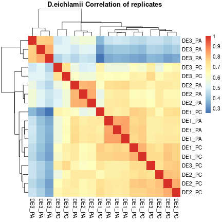

#


This report was automatically generated with the R package **knitr**
(version 1.30).


```r
#load packages
  
library(ggplot2)
library(tidyverse)
library(edgeR)
library(DESeq2)
library(PCAtools)
library(marray)
library(pheatmap)
library(dplyr)
library(SummarizedExperiment)
library(gplots)
source("functions.R")

#The data was previously exported from kallisto out using library(tximport) and library(rhdf5)

#load data
load("../data/dif_exp_analysis/DE/counts_DE.RData")

class(counts)
```

```
## [1] "matrix" "array"
```

```r
names(counts)
```

```
## NULL
```

```r
storage.mode(counts) <- "integer"

##counts matix to data frame

counts <- as.data.frame(counts)

#explore the data frame counts
class(counts)
```

```
## [1] "data.frame"
```

```r
names(counts)
```

```
##  [1] "DE1_PA" "DE1_PC" "DE1_PA" "DE1_PC" "DE1_PA" "DE1_PC" "DE2_PA" "DE2_PC" "DE2_PA"
## [10] "DE2_PC" "DE2_PA" "DE2_PC" "DE3_PA" "DE3_PC" "DE3_PA" "DE3_PC" "DE3_PA" "DE3_PC"
```

```r
View(counts)

##Select genes with at least 5 counts per million (cpm) in at least two samples

keep <- rowSums(cpm(counts) >= 5) >=2
table(keep)
```

```
## keep
##  FALSE   TRUE 
## 263082  51049
```

```r
##Cut original data

counts <- counts[keep, ]

colnames(counts)
```

```
##  [1] "DE1_PA" "DE1_PC" "DE1_PA" "DE1_PC" "DE1_PA" "DE1_PC" "DE2_PA" "DE2_PC" "DE2_PA"
## [10] "DE2_PC" "DE2_PA" "DE2_PC" "DE3_PA" "DE3_PC" "DE3_PA" "DE3_PC" "DE3_PA" "DE3_PC"
```

```r
##Use the names of columns to the matrix counts for select six experimental groups

groups <- factor(colnames(counts))

table(groups)
```

```
## groups
## DE1_PA DE1_PC DE2_PA DE2_PC DE3_PA DE3_PC 
##      3      3      3      3      3      3
```

```r
groups
```

```
##  [1] DE1_PA DE1_PC DE1_PA DE1_PC DE1_PA DE1_PC DE2_PA DE2_PC DE2_PA DE2_PC DE2_PA DE2_PC
## [13] DE3_PA DE3_PC DE3_PA DE3_PC DE3_PA DE3_PC
## Levels: DE1_PA DE1_PC DE2_PA DE2_PC DE3_PA DE3_PC
```

```r
##Create a list using the count matrix and groups

edgeRlist_DE <- DGEList(counts = counts,
                        group = groups, 
                        genes = rownames(counts))
```

```
## Repeated column names found in count matrix
```

```r
str(edgeRlist_DE)
```

```
## Formal class 'DGEList' [package "edgeR"] with 1 slot
##   ..@ .Data:List of 3
##   .. ..$ : int [1:51049, 1:18] 2320 7 0 0 1 541 46 174 191 1393 ...
##   .. .. ..- attr(*, "dimnames")=List of 2
##   .. .. .. ..$ : chr [1:51049] "TRINITY_DN92507_c0_g1_i1" "TRINITY_DN92509_c0_g1_i1" "TRINITY_DN92562_c0_g1_i1" "TRINITY_DN92545_c0_g1_i1" ...
##   .. .. .. ..$ : chr [1:18] "DE1_PA" "DE1_PC" "DE1_PA" "DE1_PC" ...
##   .. ..$ :'data.frame':	18 obs. of  3 variables:
##   .. .. ..$ group       : Factor w/ 6 levels "DE1_PA","DE1_PC",..: 1 2 1 2 1 2 3 4 3 4 ...
##   .. .. ..$ lib.size    : num [1:18] 19579851 17510171 18705452 19397696 19949592 ...
##   .. .. ..$ norm.factors: num [1:18] 1 1 1 1 1 1 1 1 1 1 ...
##   .. ..$ :'data.frame':	51049 obs. of  1 variable:
##   .. .. ..$ genes: chr [1:51049] "TRINITY_DN92507_c0_g1_i1" "TRINITY_DN92509_c0_g1_i1" "TRINITY_DN92562_c0_g1_i1" "TRINITY_DN92545_c0_g1_i1" ...
```

```r
#Normalized data using TMM method

edgeRlist_DE <- calcNormFactors(edgeRlist_DE, method = "TMM")

##Visualize the normalization factors
edgeRlist_DE$samples
```

```
##     group lib.size norm.factors
## 1  DE1_PA 19579851    1.0958411
## 2  DE1_PC 17510171    1.0629921
## 3  DE1_PA 18705452    1.0665516
## 4  DE1_PC 19397696    1.0688756
## 5  DE1_PA 19949592    1.0748097
## 6  DE1_PC 18498736    1.0720168
## 7  DE2_PA 18105539    1.0327123
## 8  DE2_PC 17165969    1.0220635
## 9  DE2_PA 19565187    1.0313683
## 10 DE2_PC 20340610    1.0126050
## 11 DE2_PA 19684846    1.0438125
## 12 DE2_PC 20012497    1.0401839
## 13 DE3_PA 19772605    0.7854821
## 14 DE3_PC 21089947    0.9312619
## 15 DE3_PA 19913389    0.8711795
## 16 DE3_PC 19925793    1.0695452
## 17 DE3_PA 19296056    0.7910070
## 18 DE3_PC 19845734    1.0128410
```

```r
##Plot the results using absolute vs relative expression in each sample to check the correct normalization

pdf("../out/dif_exp_DE/MD_plots.pdf", height = 7, width = 10)
par(mfrow = c(2, 3)) ##Generate a frame to store 6 plots in 2 rows and 3 columns
for (i in c(1:18)) {
  print(plotMD(cpm(edgeRlist_DE, log = T), column = i))
  grid(col = "blue")
  abline(h = 0, col = "red", lty = 2, lwd = 2)
}
```

```
## NULL
```

```
## NULL
```

```
## NULL
```

```
## NULL
```

```
## NULL
```

```
## NULL
```

```
## NULL
```

```
## NULL
```

```
## NULL
```

```
## NULL
```

```
## NULL
```

```
## NULL
```

```
## NULL
```

```
## NULL
```

```
## NULL
```

```
## NULL
```

```
## NULL
```

```
## NULL
```

```r
dev.off()
```

```
## png 
##   2
```

```r
#PCA to explore data

pch <- c(0,1,2,15,16,17)
colors <- rep(c("#FF3399", "#003399", "#006633"), 2)
plotMDS(edgeRlist_DE, col=colors[groups], pch=pch[groups])
legend("topright", legend=levels(groups), pch=pch, col=colors, ncol=2)
```


```r
#Heatmap to explor data

cormat <- cor(cpm(edgeRlist_DE$counts, log = T))
pheatmap(cormat, border_color = NA, main = "D.eichlamii Correlation of replicates")
```



```r
#Expresimental matrix design
design <- model.matrix(~0+edgeRlist_DE$samples$group)
design
```

```
##    edgeRlist_DE$samples$groupDE1_PA edgeRlist_DE$samples$groupDE1_PC
## 1                                 1                                0
## 2                                 0                                1
## 3                                 1                                0
## 4                                 0                                1
## 5                                 1                                0
## 6                                 0                                1
## 7                                 0                                0
## 8                                 0                                0
## 9                                 0                                0
## 10                                0                                0
## 11                                0                                0
## 12                                0                                0
## 13                                0                                0
## 14                                0                                0
## 15                                0                                0
## 16                                0                                0
## 17                                0                                0
## 18                                0                                0
##    edgeRlist_DE$samples$groupDE2_PA edgeRlist_DE$samples$groupDE2_PC
## 1                                 0                                0
## 2                                 0                                0
## 3                                 0                                0
## 4                                 0                                0
## 5                                 0                                0
## 6                                 0                                0
## 7                                 1                                0
## 8                                 0                                1
## 9                                 1                                0
## 10                                0                                1
## 11                                1                                0
## 12                                0                                1
## 13                                0                                0
## 14                                0                                0
## 15                                0                                0
## 16                                0                                0
## 17                                0                                0
## 18                                0                                0
##    edgeRlist_DE$samples$groupDE3_PA edgeRlist_DE$samples$groupDE3_PC
## 1                                 0                                0
## 2                                 0                                0
## 3                                 0                                0
## 4                                 0                                0
## 5                                 0                                0
## 6                                 0                                0
## 7                                 0                                0
## 8                                 0                                0
## 9                                 0                                0
## 10                                0                                0
## 11                                0                                0
## 12                                0                                0
## 13                                1                                0
## 14                                0                                1
## 15                                1                                0
## 16                                0                                1
## 17                                1                                0
## 18                                0                                1
## attr(,"assign")
## [1] 1 1 1 1 1 1
## attr(,"contrasts")
## attr(,"contrasts")$`edgeRlist_DE$samples$group`
## [1] "contr.treatment"
```

```r
##El término ~0 le indica a la función no incluir una columna de intersecciones y solamente incluir tantas columnas como grupos en nuestro diseño experimental
colnames(design) <- levels(edgeRlist_DE$samples$group)

design
```

```
##    DE1_PA DE1_PC DE2_PA DE2_PC DE3_PA DE3_PC
## 1       1      0      0      0      0      0
## 2       0      1      0      0      0      0
## 3       1      0      0      0      0      0
## 4       0      1      0      0      0      0
## 5       1      0      0      0      0      0
## 6       0      1      0      0      0      0
## 7       0      0      1      0      0      0
## 8       0      0      0      1      0      0
## 9       0      0      1      0      0      0
## 10      0      0      0      1      0      0
## 11      0      0      1      0      0      0
## 12      0      0      0      1      0      0
## 13      0      0      0      0      1      0
## 14      0      0      0      0      0      1
## 15      0      0      0      0      1      0
## 16      0      0      0      0      0      1
## 17      0      0      0      0      1      0
## 18      0      0      0      0      0      1
## attr(,"assign")
## [1] 1 1 1 1 1 1
## attr(,"contrasts")
## attr(,"contrasts")$`edgeRlist_DE$samples$group`
## [1] "contr.treatment"
```

```r
#data dispersion

edgeRlist_DE <- estimateDisp(edgeRlist_DE, design = design, robust = T)
plotBCV(edgeRlist_DE)
```


```r
#estimation of QL dispersions 

fit <- glmQLFit(edgeRlist_DE, design, robust=TRUE)
head(fit$coefficients)
```

```
##                              DE1_PA     DE1_PC     DE2_PA     DE2_PC     DE3_PA    DE3_PC
## TRINITY_DN92507_c0_g1_i1  -8.951289  -8.605828  -8.810293  -8.745002 -10.281577 -10.10415
## TRINITY_DN92509_c0_g1_i1 -15.718857 -14.629308 -15.227130 -15.101202 -10.384053 -14.61837
## TRINITY_DN92562_c0_g1_i1 -18.861381 -17.568910 -17.579060 -18.861381  -9.619157 -17.05124
## TRINITY_DN92545_c0_g1_i1 -16.730846 -18.861381 -12.712286 -18.861381  -9.873732 -16.44049
## TRINITY_DN92510_c0_g1_i1 -15.518930 -15.041296 -13.578735 -13.715454  -8.849357 -14.41083
## TRINITY_DN92538_c0_g1_i1 -10.611386 -11.169925  -9.850952 -10.599612  -9.694504 -11.41230
```

```r
#Plot QL dispersion

plotQLDisp(fit)
```


```r
summary(fit$df.prior)
```

```
##    Min. 1st Qu.  Median    Mean 3rd Qu.    Max. 
##   2.094   2.094   2.235   2.189   2.266   2.266
```

```r
#Contrast matrix for three comparisons

contrast_matrix <- makeContrasts(
  DE1_PAvsDE2_ = DE1_PA - DE2_PA ,
  DE2_PAvsDE3_ = DE2_PA - DE3_PA ,
  DE1_PAvsDE3_ = DE1_PA - DE3_PA , 
  DE1_PCvsDE2_ = DE1_PC - DE2_PC ,
  DE2_PCvsDE3_ = DE2_PC - DE3_PC ,
  DE1_PCvsDE3_ = DE1_PC - DE3_PC , levels=design)

contrast_matrix
```

```
##         Contrasts
## Levels   DE1_PAvsDE2_ DE2_PAvsDE3_ DE1_PAvsDE3_ DE1_PCvsDE2_ DE2_PCvsDE3_ DE1_PCvsDE3_
##   DE1_PA            1            0            1            0            0            0
##   DE1_PC            0            0            0            1            0            1
##   DE2_PA           -1            1            0            0            0            0
##   DE2_PC            0            0            0           -1            1            0
##   DE3_PA            0           -1           -1            0            0            0
##   DE3_PC            0            0            0            0           -1           -1
```

```r
#Adjust data to Binomial (BN) method

pdf("../out/dif_exp_DE/volcano_plots.pdf", height = 7, width = 10)
par(mfrow = c(2, 3)) ##Generate a frame to store 6 plots in 2 rows and 3 columns
for (i in c(1:6)) {
  qlf.BvsA.lfc1 <- glmTreat(fit, 
                            contrast = contrast_matrix[, i], 
                            lfc = 1)
  deg.BvsA.lfc1 <- decideTestsDGE(qlf.BvsA.lfc1, p.value = 0.05, adjust.method = "BH", lfc = 1)
  table(deg.BvsA.lfc1)
  
  #seleccionar los genes que estadísticamente tienen |lfc| > 1 y robustecer nuestros resultados
  DEG.BvsA.lfc1 <- DEGResults(qlf.BvsA.lfc1)
  DEG.BvsA.lfc1 <- edgeResults(DEG.BvsA.lfc1, logfc = 1, padj = 0.05)
  print(volcano_edgeR(DEG.BvsA.lfc1, lfc = 1, padj = 0.05)) #print volcano_plots
}
dev.off()
```

```
## png 
##   2
```

```r
#Significant genes
significant.genes <- DEG.BvsA.lfc1 %>% filter(FDR < 0.05 & logFC > 1 | FDR < 0.05 & logFC < -1)
paste("The number of significant genes with |lfc| > 1 is", length(significant.genes$genes))
```

```
## [1] "The number of significant genes with |lfc| > 1 is 702"
```

```r
##Heatmap of genes significant 
##Get names or ids from genes with differential expression
significant.ids <- significant.genes$genes
##Create a count matrix normalize by cpm (count per million), using the counts saved in the edgeRlist_DE object
significant.cpm <- cpm(edgeRlist_DE$counts, log = T)
##Cut genes with significative expression
significant.cpm <- significant.cpm[significant.ids, ]

##Generate a color palette

OBW <- maPalette(low = "orange", high = "blue", mid = "white")

##get heatmap 

pheatmap(significant.cpm, 
         border_color = NA, 
         color = OBW,
         show_rownames = F,
         anotation_col = T, 
         scale = "row", 
         angle_col = 0,
         fontsize = 12,
         fontsize_col = 6,
         main = "D.eichalmii")
```


```r
#Using the data in significant.cpm we will extrac the gene clusters

significant.cpm
```

```
##                                DE1_PA      DE1_PC      DE1_PA      DE1_PC       DE1_PA
## TRINITY_DN28557_c3_g1_i2   7.80542469  8.96689157  8.62868891  9.37771754  8.191749965
## TRINITY_DN29894_c2_g2_i10  2.15203347 -3.27450910  2.66861863 -3.27450910  2.801292858
## TRINITY_DN18046_c0_g2_i1   6.91695045  6.42044201  6.65261237  5.99131834  6.671860035
## TRINITY_DN30212_c1_g3_i1   5.18650746  0.24905069  5.25425776  0.72239306  5.334667768
## TRINITY_DN27812_c2_g2_i2   1.85892456 -1.36256702  2.55509413 -0.57686509  2.589343597
## TRINITY_DN28874_c1_g1_i1   6.27382619 -2.63979441  6.18605285 -1.95456285  6.026076656
## TRINITY_DN24945_c0_g3_i1  -1.28708256  0.10327008 -1.65661355 -0.37048205 -0.725935834
## TRINITY_DN25747_c0_g2_i2   6.69099912  6.97435239  6.90771199  7.32303055  6.634498465
## TRINITY_DN26232_c3_g4_i1   1.61615521  1.14821737  1.98276028  1.74465591  1.770481954
## TRINITY_DN28557_c3_g2_i3   5.78421227  6.78710842  6.71781112  7.41131271  6.236360324
## TRINITY_DN20385_c0_g1_i1  -2.69512128 -1.86422661 -2.67298610 -1.27698684 -1.307217829
## TRINITY_DN28557_c3_g2_i7   9.55830468  8.86508195  9.67933517  8.60310989  9.707895291
## TRINITY_DN7639_c0_g1_i1    2.23263084  0.44334548  1.75035871  0.04444520  2.057822473
## TRINITY_DN81494_c0_g1_i1   2.23263084  0.44334548  1.75035871  0.04444520  2.057822473
## TRINITY_DN28557_c3_g1_i3   4.70312148  5.87101851  5.67989906  6.55981785  5.411437816
## TRINITY_DN11823_c1_g1_i1   3.16832533  3.30291738  3.23349549  3.25360353  3.483010861
## TRINITY_DN28413_c5_g8_i1   3.98958119  5.15484021  3.50207755  5.19387084  3.990331807
## TRINITY_DN88441_c0_g1_i1   4.39528432  3.91868965  4.36681956  3.65295076  4.416630654
## TRINITY_DN24787_c0_g1_i1   4.84575292  5.34319764  5.43982974  4.75286609  5.224863349
## TRINITY_DN30219_c1_g2_i7   3.59758757  3.72043740  3.68710127  4.20602056  3.521304307
## TRINITY_DN27812_c2_g3_i1  -0.20184998 -1.59170091  0.57851393 -2.27616045  0.270374247
## TRINITY_DN18590_c0_g1_i1  -3.27450910 -3.27450910 -3.27450910 -3.27450910 -3.274509098
## TRINITY_DN28466_c0_g1_i1   4.35624447  6.73159311  4.31351192  5.84372576  4.558418447
## TRINITY_DN29574_c5_g1_i13  2.96631039  2.87897392  3.23349549  3.26911615  3.244425079
## TRINITY_DN25406_c0_g3_i1  -0.58826277  0.24905069 -0.77476335  0.62929744 -1.138518619
## TRINITY_DN30059_c3_g1_i6   5.14754234  5.43175733  5.05058139  5.36063052  5.161617133
## TRINITY_DN18046_c0_g1_i1   6.21056230  5.04931366  6.21437412  5.19590136  6.069795992
## TRINITY_DN58100_c0_g1_i1   1.20130526  3.13487949  1.29607342  3.02600893  0.329120143
## TRINITY_DN29736_c3_g1_i3   6.79020084  7.68998140  6.59234239  7.75182021  6.706894585
## TRINITY_DN29438_c3_g1_i19  0.87956469  1.07188573  0.81607695  0.36630714  0.893566410
## TRINITY_DN20200_c0_g1_i1   2.83822606  4.84374661  2.87193965  4.41220030  2.852254590
## TRINITY_DN30152_c0_g1_i33  3.20873429  3.29454466  3.51562834  2.51666178  3.508652426
## TRINITY_DN33723_c0_g1_i1   2.26364993  4.43139370  1.70376580  4.71655271  1.986617980
## TRINITY_DN30152_c0_g1_i11  5.14129260  4.68304884  5.03655030  4.53277267  4.800813320
## TRINITY_DN37698_c0_g1_i1   3.01269631  3.42300487  3.01237771  4.00760973  3.174059261
## TRINITY_DN20800_c0_g1_i2  -0.48153282  1.22071251 -0.32495037  0.52977752 -0.987496910
## TRINITY_DN23233_c0_g1_i2   3.53539909  3.86880462  3.50886885  4.67639595  3.221349049
## TRINITY_DN29780_c0_g2_i11  2.80698041  3.82296628  2.26539225  4.60484337  2.715813826
## TRINITY_DN19736_c0_g1_i1  -3.27450910 -3.27450910 -3.27450910 -3.27450910 -3.274509098
## TRINITY_DN21741_c0_g1_i3   4.66005476  5.05179974  4.58175208  5.42089893  4.530528133
## TRINITY_DN18174_c1_g1_i1  -2.69512128 -3.27450910 -3.27450910 -3.27450910 -2.703992337
## TRINITY_DN28033_c5_g2_i1   1.79666126  3.28612307  2.55509413  3.68799705  2.237246642
## TRINITY_DN15911_c0_g1_i1  -2.69512128 -3.27450910 -3.27450910 -2.69064729 -3.274509098
## TRINITY_DN18546_c0_g2_i1   4.82510664  4.29953426  4.66922761  4.12734728  4.679065807
## TRINITY_DN20183_c0_g1_i2   4.63061239  1.07188573  4.59457803  0.97028793  4.505275837
## TRINITY_DN20855_c0_g1_i1   0.66398721 -0.14739929  1.26431783  0.58039545  1.683100745
## TRINITY_DN100411_c0_g1_i1  4.48685588  5.03681860  4.32510197  5.53597485  4.413240556
## TRINITY_DN42937_c0_g1_i1   1.29436778  3.53386005  0.77159118  3.91203352  0.270374247
## TRINITY_DN21829_c0_g2_i1   2.04896873  2.85639776  1.55421524  3.04415575  1.749127798
## TRINITY_DN21649_c0_g1_i1  -0.48153282  2.37465019  0.01744763  2.97015735  0.684487790
## TRINITY_DN22233_c0_g1_i4   1.13575181  1.53690556  1.77310277  1.83080665  1.613906329
## TRINITY_DN27040_c2_g3_i1   6.96433438  4.21776341  6.80592323  4.47374571  7.084757217
## TRINITY_DN24197_c0_g3_i5   0.10262665  2.77447725  0.35554507  3.31467762 -0.143432230
## TRINITY_DN24088_c1_g2_i4   3.38129271  1.97441485  3.52905304  2.07981900  3.570830667
## TRINITY_DN58980_c0_g1_i1   2.68624977  2.94465708  1.38735005  1.78837425  1.727452812
##                                DE1_PC      DE2_PA      DE2_PC      DE2_PA      DE2_PC
## TRINITY_DN28557_c3_g1_i2   8.92634004  4.34469683  7.42881639  5.79196089  7.54020624
## TRINITY_DN29894_c2_g2_i10 -3.27450910  4.72513390  5.31800433  4.86970927  5.02679572
## TRINITY_DN18046_c0_g2_i1   6.15358780  5.41572440  3.54794864  5.55843991  4.02047686
## TRINITY_DN30212_c1_g3_i1   1.17992558  5.86995168  2.53911169  6.03060795  2.20986258
## TRINITY_DN27812_c2_g2_i2  -0.90022453  3.12424334  2.58185122  3.50434086  1.76436482
## TRINITY_DN28874_c1_g1_i1  -2.24156432  7.02857611 -1.34148098  6.52598391 -1.99522038
## TRINITY_DN24945_c0_g3_i1  -0.90022453  1.43254877  5.43335611  0.71076950  5.34213738
## TRINITY_DN25747_c0_g2_i2   6.99087637  6.31336438  6.08682968  6.65158001  5.83871046
## TRINITY_DN26232_c3_g4_i1   1.87623287  3.28001472  1.53583947  2.74344682  0.61264543
## TRINITY_DN28557_c3_g2_i3   6.71242017  2.27895656  5.29035236  3.59255960  5.52114499
## TRINITY_DN20385_c0_g1_i1  -1.64578531  8.71207027  4.50130808  7.67917711  4.09292465
## TRINITY_DN28557_c3_g2_i7   8.43132180  6.63932053  6.59006665  8.14676015  7.30794280
## TRINITY_DN7639_c0_g1_i1    0.17688243  0.72231667  3.17253923  1.03250029  2.34163757
## TRINITY_DN81494_c0_g1_i1   0.17688243  0.72231667  3.17253923  1.03250029  2.34163757
## TRINITY_DN28557_c3_g1_i3   5.94408508  1.43254877  4.28124789  2.61693651  4.78839687
## TRINITY_DN11823_c1_g1_i1   3.36740652  2.77433576  0.69418111  2.96737699  1.21142595
## TRINITY_DN28413_c5_g8_i1   4.82657582  4.54912212  5.52381629  4.22950503  5.65385240
## TRINITY_DN88441_c0_g1_i1   3.35982979  3.89776691  2.25208985  3.91446093  2.62067003
## TRINITY_DN24787_c0_g1_i1   4.90415708  6.15688684  6.82835121  6.21561599  6.87716864
## TRINITY_DN30219_c1_g2_i7   3.67885047  2.08600901  2.33771051  2.75441611  2.59741939
## TRINITY_DN27812_c2_g3_i1  -2.66750003  1.37226578  1.17553636  1.71027619 -0.09063739
## TRINITY_DN18590_c0_g1_i1  -2.24156432  7.94862593  3.66520793  7.01186289  3.15436756
## TRINITY_DN28466_c0_g1_i1   6.03133094  6.79524534  7.82139231  6.61142038  7.83830573
## TRINITY_DN29574_c5_g1_i13  3.38990085  2.66551196  3.91406893  3.30985837  5.04409697
## TRINITY_DN25406_c0_g3_i1   0.42939570  3.88163950  2.68999523  2.90966992  2.66607652
## TRINITY_DN30059_c3_g1_i6   5.36790696  4.05942909  4.00062177  4.68426010  4.05928427
## TRINITY_DN18046_c0_g1_i1   5.18062397  4.56604061  2.86169334  5.24510066  3.07242172
## TRINITY_DN58100_c0_g1_i1   2.57084589  3.84883354  4.67913867  3.51082425  4.84871668
## TRINITY_DN29736_c3_g1_i3   7.75025269  6.89435665  8.81920327  6.93440059  8.64312126
## TRINITY_DN29438_c3_g1_i19 -0.90022453  3.27178817  1.24809636  2.50448312  2.28455134
## TRINITY_DN20200_c0_g1_i1   4.59125911  5.62071330  6.56098749  5.27778040  6.88439085
## TRINITY_DN30152_c0_g1_i33  2.97959654  4.85745970  4.84622724  4.99292176  4.37515661
## TRINITY_DN33723_c0_g1_i1   4.36395765 -0.28392462  2.10356001 -0.48060784  2.13109503
## TRINITY_DN30152_c0_g1_i11  4.83479770  6.26029830  6.14142520  5.89096217  5.39534760
## TRINITY_DN37698_c0_g1_i1   3.96012745  0.05974350  3.23635587  0.95854125  2.83463254
## TRINITY_DN20800_c0_g1_i2   0.64422578  0.86038625  2.06390885  1.46525506  2.51295803
## TRINITY_DN23233_c0_g1_i2   4.39022934  1.46177124  3.56934618  1.77634328  3.57318002
## TRINITY_DN29780_c0_g2_i11  4.04761632  1.27683791  3.20023558  0.88058489  2.54976284
## TRINITY_DN19736_c0_g1_i1  -3.27450910  0.20507197 -0.03332858 -0.58734977 -0.09063739
## TRINITY_DN21741_c0_g1_i3   5.18706064  2.40466385  4.51239799  2.45154488  4.26879396
## TRINITY_DN18174_c1_g1_i1  -2.24156432  4.98118655 -0.31760858  3.20980310 -0.52846054
## TRINITY_DN28033_c5_g2_i1   3.85086357  4.16091620  4.08227456  3.76518389  3.63157258
## TRINITY_DN15911_c0_g1_i1  -3.27450910  4.50768941 -0.31760858  2.45154488 -0.63457305
## TRINITY_DN18546_c0_g2_i1   4.39394369  2.27895656  2.75368725  2.76530263  2.64355191
## TRINITY_DN20183_c0_g1_i2   1.10938425  6.01500697  0.69418111  5.61219083  1.51422529
## TRINITY_DN20855_c0_g1_i1   1.10938425  5.15002606  3.12516328  4.46474333  1.56305044
## TRINITY_DN100411_c0_g1_i1  5.25194362  1.06466411  3.79196720  1.71027619  3.90212029
## TRINITY_DN42937_c0_g1_i1   3.82907937  1.54604664  3.69146645  1.29540314  3.59094728
## TRINITY_DN21829_c0_g2_i1   3.08445391  2.41963420  4.28124789  2.50448312  3.80904316
## TRINITY_DN21649_c0_g1_i1   3.19928619  2.73896545  3.94167863  2.10247613  3.81912838
## TRINITY_DN22233_c0_g1_i4   1.81105125  3.46456621  3.56934618  3.05870464  3.13834653
## TRINITY_DN27040_c2_g3_i1   4.30599659 10.07702843  5.74365585 10.03873960  5.29413804
## TRINITY_DN24197_c0_g3_i5   2.57084589  3.36753978  4.65265272  2.68731331  4.53971620
## TRINITY_DN24088_c1_g2_i4   1.24717795  3.34419104  3.75509496  3.30985837  3.63728392
## TRINITY_DN58980_c0_g1_i1   2.09281198  6.11381376  1.31718106  5.98476867  0.18365629
##                                DE2_PA       DE2_PC      DE3_PA       DE3_PC      DE3_PA
## TRINITY_DN28557_c3_g1_i2   5.25372109  7.453220159 -1.97105471  1.559882461 -2.29494136
## TRINITY_DN29894_c2_g2_i10  4.74547391  4.619884663  4.11681566  3.289272986  3.53644331
## TRINITY_DN18046_c0_g2_i1   4.97252919  3.649105465 -0.21429601  0.965369358  0.49466688
## TRINITY_DN30212_c1_g3_i1   5.80955541  2.925744352  6.30378741  4.961659730  5.71231881
## TRINITY_DN27812_c2_g2_i2   3.42231961  2.523514806  5.49392043  6.819582528  4.33917605
## TRINITY_DN28874_c1_g1_i1   6.78116032 -0.229597255 -0.49361818  5.017636941 -0.40322051
## TRINITY_DN24945_c0_g3_i1   1.60870034  5.978744488  5.04339268  6.673768994  4.69292359
## TRINITY_DN25747_c0_g2_i2   6.49461734  5.923991904  4.41581597  2.592238085  5.24859263
## TRINITY_DN26232_c3_g4_i1   3.28620610  1.766077797  1.52855495  6.417843414  2.06037796
## TRINITY_DN28557_c3_g2_i3   3.13590009  5.340849700 -3.27450910  0.006110454 -3.27450910
## TRINITY_DN20385_c0_g1_i1   8.40403198  4.363909466  6.78735441  4.779382782  8.08041789
## TRINITY_DN28557_c3_g2_i7   7.42594090  6.281786768 -0.49361818  1.605556020 -0.06335151
## TRINITY_DN7639_c0_g1_i1    0.28800671  3.128943009 -3.27450910  4.950641346 -3.27450910
## TRINITY_DN81494_c0_g1_i1   0.28800671  3.128943009 -3.27450910  4.950641346 -3.27450910
## TRINITY_DN28557_c3_g1_i3   2.42937286  4.535363205 -3.27450910 -0.474434719 -2.70313590
## TRINITY_DN11823_c1_g1_i1   2.76744419  0.634533498  1.21948893 -2.729699335  0.93445609
## TRINITY_DN28413_c5_g8_i1   4.49551337  5.941692919  6.07074108  7.654145137  6.01419405
## TRINITY_DN88441_c0_g1_i1   3.63192608  2.104577486  4.46620116  0.136291569  4.68167572
## TRINITY_DN24787_c0_g1_i1   6.19387510  6.964344933  2.01727794  1.161603325  2.45328303
## TRINITY_DN30219_c1_g2_i7   2.64390248  2.137718398  0.69652083 -1.050893872  1.04392003
## TRINITY_DN27812_c2_g3_i1   1.05974324  0.587333222  3.74465308  4.926100551  2.46645146
## TRINITY_DN18590_c0_g1_i1   7.79738320  3.660552392  5.97190642  4.102077082  7.21281521
## TRINITY_DN28466_c0_g1_i1   6.90006603  7.980685239  6.89488082  1.754905344  8.09691800
## TRINITY_DN29574_c5_g1_i13  2.70137229  4.314041948  7.46607600  9.410498352  6.71641844
## TRINITY_DN25406_c0_g3_i1   3.95853554  3.529344843  3.11278669  4.532783941  4.02888565
## TRINITY_DN30059_c3_g1_i6   3.92032056  3.566328283  2.05288280  0.197226622  2.11156821
## TRINITY_DN18046_c0_g1_i1   4.67836417  3.087139344 -1.71008761 -0.382391766  0.27277038
## TRINITY_DN58100_c0_g1_i1   3.66696816  4.874554527 -0.21429601 -0.792104875 -0.06335151
## TRINITY_DN29736_c3_g1_i3   6.89699455  9.264838737  8.85728149 10.144014794  8.89349036
## TRINITY_DN29438_c3_g1_i19  3.31594819  0.634533498  4.93784579  5.764133378  4.77988251
## TRINITY_DN20200_c0_g1_i1   5.45258758  6.752695110  6.09442688  1.488540913  7.23750990
## TRINITY_DN30152_c0_g1_i33  4.82519607  4.391649913  4.59858100  5.314351704  5.23903272
## TRINITY_DN33723_c0_g1_i1  -0.70993818  2.754713816  1.08837369  0.072668870  2.51795514
## TRINITY_DN30152_c0_g1_i11  6.11359229  5.744696370  5.91499938  6.713420866  6.19515424
## TRINITY_DN37698_c0_g1_i1  -0.04848717  2.827609470  0.98157285 -1.771001666  2.39937339
## TRINITY_DN20800_c0_g1_i2   1.42983894  1.536844863  3.59569699  5.725869433  4.20419660
## TRINITY_DN23233_c0_g1_i2   1.70175829  3.335868344 -3.27450910 -0.792104875 -3.27450910
## TRINITY_DN29780_c0_g2_i11  0.60952344  2.498218834  0.78386891  0.006110454  1.20970890
## TRINITY_DN19736_c0_g1_i1  -0.38883178  0.587333222  2.43661974  4.573575366  1.35839454
## TRINITY_DN21741_c0_g1_i3   1.98702195  4.284752706 -2.69978055 -2.335165203 -0.72376293
## TRINITY_DN18174_c1_g1_i1   3.90572487 -0.614849785  8.18241957  3.726565161  8.06237237
## TRINITY_DN28033_c5_g2_i1   3.83558839  4.161260690  6.04886579  7.042478437  5.02875720
## TRINITY_DN15911_c0_g1_i1   3.68417511  0.266222020  7.01200576  2.793112997  7.20694275
## TRINITY_DN18546_c0_g2_i1   1.81022681  2.446256093 -0.39437929  0.365961349  0.77424952
## TRINITY_DN20183_c0_g1_i2   6.19787416  1.766077797  1.69554507  5.017636941  1.81480824
## TRINITY_DN20855_c0_g1_i1   4.92748089  1.945232729  6.79985081  4.994218799  6.27684395
## TRINITY_DN100411_c0_g1_i1  1.34583059  4.086850379 -2.28988738 -2.729699335  0.27277038
## TRINITY_DN42937_c0_g1_i1   1.85142930  3.262644693 -2.69978055 -2.335165203 -2.70313590
## TRINITY_DN21829_c0_g2_i1   2.25610077  4.370894744  3.93318037  5.573317552  3.77739581
## TRINITY_DN21649_c0_g1_i1   2.52160249  4.631564858  5.30382743  7.052304409  5.37443190
## TRINITY_DN22233_c0_g1_i4   3.25583792  3.378082550  3.21061004  4.635433167  3.99747835
## TRINITY_DN27040_c2_g3_i1  10.04604723  5.801379792  7.09866885  6.502518355  8.22834527
## TRINITY_DN24197_c0_g3_i5   3.60205979  4.541567446  6.95374892  6.084505016  6.38742132
## TRINITY_DN24088_c1_g2_i4   3.28620610  3.699916175  5.30935823  5.415584983  4.05527249
## TRINITY_DN58980_c0_g1_i1   5.85077681  0.680238331 -3.27450910 -3.274509098 -2.70313590
##                                 DE3_PC      DE3_PA      DE3_PC
## TRINITY_DN28557_c3_g1_i2   1.385514614 -1.95001466  1.01300499
## TRINITY_DN29894_c2_g2_i10  3.936379710  4.11775741  3.57829567
## TRINITY_DN18046_c0_g2_i1   1.328996664 -0.81157905  0.97652611
## TRINITY_DN30212_c1_g3_i1   5.142987316  5.72411068  4.98627560
## TRINITY_DN27812_c2_g2_i2   6.192278206  5.74934811  6.35551187
## TRINITY_DN28874_c1_g1_i1   4.359600165 -0.68598346  4.13653625
## TRINITY_DN24945_c0_g3_i1   7.678869222  6.01862486  7.75063105
## TRINITY_DN25747_c0_g2_i2   3.334910726  4.13061979  2.56023475
## TRINITY_DN26232_c3_g4_i1   6.264690759  1.75200208  5.91330574
## TRINITY_DN28557_c3_g2_i3   0.210702565 -3.27450910  0.59857837
## TRINITY_DN20385_c0_g1_i1   5.777590238  7.02839763  4.72830124
## TRINITY_DN28557_c3_g2_i7   2.024337798 -1.95001466  2.47126965
## TRINITY_DN7639_c0_g1_i1    5.298253172 -3.27450910  4.80571892
## TRINITY_DN81494_c0_g1_i1   5.298253172 -3.27450910  4.80571892
## TRINITY_DN28557_c3_g1_i3  -2.295384071 -3.27450910 -1.30160952
## TRINITY_DN11823_c1_g1_i1  -1.717447561 -0.10078373 -2.70152843
## TRINITY_DN28413_c5_g8_i1   7.797521366  6.24151241  7.45786161
## TRINITY_DN88441_c0_g1_i1  -0.609575258  4.13061979 -0.84466701
## TRINITY_DN24787_c0_g1_i1   1.854544409  2.10470218  0.49921719
## TRINITY_DN30219_c1_g2_i7  -0.724507936  0.25295635  0.01483686
## TRINITY_DN27812_c2_g3_i1   4.686415848  4.15600555  4.38290696
## TRINITY_DN18590_c0_g1_i1   4.968973458  6.27375834  3.83416032
## TRINITY_DN28466_c0_g1_i1   2.649901396  7.77961214  2.65561417
## TRINITY_DN29574_c5_g1_i13  7.816274477  7.25968125  8.27445193
## TRINITY_DN25406_c0_g3_i1   4.620246580  3.74654093  4.37241588
## TRINITY_DN30059_c3_g1_i6   1.969930512  1.99644128  1.36310682
## TRINITY_DN18046_c0_g1_i1   0.330700657 -0.94916023  0.86120555
## TRINITY_DN58100_c0_g1_i1  -0.224090769 -0.18327380 -0.39898068
## TRINITY_DN29736_c3_g1_i3   9.790411112  9.03639613  9.85572363
## TRINITY_DN29438_c3_g1_i19  5.830714654  4.98478021  6.28641151
## TRINITY_DN20200_c0_g1_i1   1.951329034  6.83370516  1.75642720
## TRINITY_DN30152_c0_g1_i33  5.879494525  4.82514702  5.76746141
## TRINITY_DN33723_c0_g1_i1   0.330700657  1.81710290 -0.98150635
## TRINITY_DN30152_c0_g1_i11  7.286160774  6.29866614  7.21478840
## TRINITY_DN37698_c0_g1_i1  -0.403996072  1.68382422 -1.49295249
## TRINITY_DN20800_c0_g1_i2   5.389169066  2.82773538  4.65228581
## TRINITY_DN23233_c0_g1_i2   0.210702565 -3.27450910  0.54975301
## TRINITY_DN29780_c0_g2_i11 -0.311240943 -0.02275625 -1.13269808
## TRINITY_DN19736_c0_g1_i1   3.223052079  2.76312344  4.16112469
## TRINITY_DN21741_c0_g1_i3  -0.141906593 -2.68812029 -0.98150635
## TRINITY_DN18174_c1_g1_i1   2.750160462  8.18817070  2.37645580
## TRINITY_DN28033_c5_g2_i1   7.156662870  5.89592126  6.56963044
## TRINITY_DN15911_c0_g1_i1   2.342490759  7.07516757  1.95698235
## TRINITY_DN18546_c0_g2_i1   0.815154020 -0.68598346  0.15200749
## TRINITY_DN20183_c0_g1_i2   3.792268132  2.26883262  4.71728932
## TRINITY_DN20855_c0_g1_i1   5.453370073  6.31472255  4.68656583
## TRINITY_DN100411_c0_g1_i1 -0.503126966 -1.68669539 -1.71361060
## TRINITY_DN42937_c0_g1_i1  -0.224090769 -2.68812029 -0.98150635
## TRINITY_DN21829_c0_g2_i1   5.307424128  3.52414302  5.18119774
## TRINITY_DN21649_c0_g1_i1   5.860927707  5.23159102  6.80496972
## TRINITY_DN22233_c0_g1_i4   4.425100856  3.55627649  4.18530106
## TRINITY_DN27040_c2_g3_i1   6.959593286  7.27279457  6.70120430
## TRINITY_DN24197_c0_g3_i5   6.132644162  6.95557198  5.43919738
## TRINITY_DN24088_c1_g2_i4   5.330999311  5.46615753  4.81607848
## TRINITY_DN58980_c0_g1_i1  -2.703429631 -3.27450910 -2.29251937
##  [ reached getOption("max.print") -- omitted 647 rows ]
```

```r
#Heatmat to extract dendogram to get expression clusters

DE_HS<- cim(t(significant.cpm), color = NULL, symkey = FALSE, row.cex = NULL,
            col.cex = NULL, margins = c(2, 4))
```


```r
#plot the dendogram only 
plot(DE_HS$ddc, leaflab="none")
abline(h=25, lwd=2, col="red")
```


```r
#Using this dendrogram, we might want to cut the tree at level h=25. using the function cutree, which will provide a cluster membership for each gene.
geneClust <- cutree(as.hclust(DE_HS$ddc), h=25)
head(geneClust)
```

```
##  TRINITY_DN28557_c3_g1_i2 TRINITY_DN29894_c2_g2_i10  TRINITY_DN18046_c0_g2_i1 
##                         1                         2                         3 
##  TRINITY_DN30212_c1_g3_i1  TRINITY_DN27812_c2_g2_i2  TRINITY_DN28874_c1_g1_i1 
##                         2                         4                         5
```

```r
#To see the gene clust total
length(unique(geneClust))
```

```
## [1] 10
```

```r
#To explore genes in every gene cluster
names(which(geneClust == 10))
```

```
##  [1] "TRINITY_DN18174_c1_g1_i1" "TRINITY_DN15911_c0_g1_i1" "TRINITY_DN20423_c0_g1_i1"
##  [4] "TRINITY_DN14264_c0_g1_i1" "TRINITY_DN31559_c0_g1_i1" "TRINITY_DN19081_c0_g1_i1"
##  [7] "TRINITY_DN17326_c0_g1_i1" "TRINITY_DN21067_c0_g1_i1" "TRINITY_DN28143_c0_g2_i4"
## [10] "TRINITY_DN91466_c0_g1_i1" "TRINITY_DN92645_c0_g1_i1" "TRINITY_DN17827_c0_g1_i1"
## [13] "TRINITY_DN26323_c0_g1_i2" "TRINITY_DN88741_c0_g1_i1" "TRINITY_DN56058_c0_g1_i1"
## [16] "TRINITY_DN39014_c0_g1_i1" "TRINITY_DN12962_c0_g1_i1" "TRINITY_DN30470_c2_g3_i2"
## [19] "TRINITY_DN18174_c0_g1_i1" "TRINITY_DN23214_c0_g2_i2" "TRINITY_DN55946_c0_g1_i1"
## [22] "TRINITY_DN11811_c0_g1_i1" "TRINITY_DN42058_c0_g1_i1" "TRINITY_DN31451_c0_g1_i1"
## [25] "TRINITY_DN79667_c0_g1_i1" "TRINITY_DN95552_c0_g1_i1"
```

```r
##analysis purposes, it’s convenient to convert this vector into a tibble, so we can join it with our table of gene expression counts that will be used to make a plot:

class(geneClust)
```

```
## [1] "integer"
```

```r
##convert geneClust matrix to vector

geneClust<-as.vector(geneClust)

##Convert geneClust in a tibble
geneClust <- cutree(as.hclust(DE_HS$ddc), h=21)
geneClust<-enframe(geneClust, name = "genes", value = "cluster")


#sample clustering to identify outliers using hclust function

hc <- hclust(as.dist(1-cor(significant.cpm, method="spearman")), method="complete") # Clusters columns by Spearman correlation.
TreeC = as.dendrogram(hc, method="average")
plot(TreeC,
     main = "Sample Clustering D.eichlamii",
     ylab = "Height")
```


```r
#kegga function to annotate my genes using Arabidopsis thaliana

k<-kegga(qlf.BvsA.lfc1, species = "At")
```

```
## Error in kegga.default(de = DEGenes, universe = universe, ...): Pathways do not overlap with universe
```

```r
#explore k
head(k)
```

```
##                                                Pathway   N DE P.DE
## path:ath00010             Glycolysis / Gluconeogenesis 119  0    1
## path:ath00020                Citrate cycle (TCA cycle)  63  0    1
## path:ath00030                Pentose phosphate pathway  58  0    1
## path:ath00040 Pentose and glucuronate interconversions 107  0    1
## path:ath00051          Fructose and mannose metabolism  64  0    1
## path:ath00052                     Galactose metabolism  57  0    1
```

The R session information (including the OS info, R version and all
packages used):


```r
sessionInfo()
```

```
## R version 4.0.3 (2020-10-10)
## Platform: x86_64-pc-linux-gnu (64-bit)
## Running under: Ubuntu 20.04.1 LTS
## 
## Matrix products: default
## BLAS:   /usr/lib/x86_64-linux-gnu/blas/libblas.so.3.9.0
## LAPACK: /usr/lib/x86_64-linux-gnu/lapack/liblapack.so.3.9.0
## 
## locale:
##  [1] LC_CTYPE=es_MX.UTF-8       LC_NUMERIC=C               LC_TIME=es_MX.UTF-8       
##  [4] LC_COLLATE=es_MX.UTF-8     LC_MONETARY=es_MX.UTF-8    LC_MESSAGES=es_MX.UTF-8   
##  [7] LC_PAPER=es_MX.UTF-8       LC_NAME=C                  LC_ADDRESS=C              
## [10] LC_TELEPHONE=C             LC_MEASUREMENT=es_MX.UTF-8 LC_IDENTIFICATION=C       
## 
## attached base packages:
## [1] parallel  stats4    stats     graphics  grDevices utils     datasets  methods  
## [9] base     
## 
## other attached packages:
##  [1] RColorBrewer_1.1-2          mixOmics_6.14.0             lattice_0.20-41            
##  [4] MASS_7.3-53                 gplots_3.1.1                pheatmap_1.0.12            
##  [7] marray_1.68.0               PCAtools_2.2.0              ggrepel_0.9.0              
## [10] DESeq2_1.30.0               SummarizedExperiment_1.20.0 Biobase_2.50.0             
## [13] MatrixGenerics_1.2.0        matrixStats_0.57.0          GenomicRanges_1.42.0       
## [16] GenomeInfoDb_1.26.2         IRanges_2.24.1              S4Vectors_0.28.1           
## [19] BiocGenerics_0.36.0         edgeR_3.32.0                limma_3.46.0               
## [22] forcats_0.5.0               stringr_1.4.0               purrr_0.3.4                
## [25] readr_1.4.0                 tibble_3.0.4                tidyverse_1.3.0            
## [28] tidyr_1.1.2                 formattable_0.2.1           pander_0.6.3               
## [31] ggplot2_3.3.3               dplyr_1.0.2                 nortest_1.0-4              
## [34] psych_2.0.12               
## 
## loaded via a namespace (and not attached):
##   [1] readxl_1.3.1              backports_1.2.1           plyr_1.8.6               
##   [4] igraph_1.2.6              splines_4.0.3             BiocParallel_1.24.1      
##   [7] digest_0.6.27             htmltools_0.5.0           fansi_0.4.1              
##  [10] magrittr_2.0.1            memoise_1.1.0             annotate_1.68.0          
##  [13] modelr_0.1.8              rARPACK_0.11-0            colorspace_2.0-0         
##  [16] blob_1.2.1                rvest_0.3.6               haven_2.3.1              
##  [19] xfun_0.19                 crayon_1.3.4              RCurl_1.98-1.2           
##  [22] jsonlite_1.7.2            genefilter_1.72.0         survival_3.2-7           
##  [25] glue_1.4.2                gtable_0.3.0              zlibbioc_1.36.0          
##  [28] XVector_0.30.0            DelayedArray_0.16.0       BiocSingular_1.6.0       
##  [31] scales_1.1.1              DBI_1.1.0                 Rcpp_1.0.5               
##  [34] xtable_1.8-4              tmvnsim_1.0-2             dqrng_0.2.1              
##  [37] bit_4.0.4                 rsvd_1.0.3                htmlwidgets_1.5.3        
##  [40] httr_1.4.2                ellipsis_0.3.1            pkgconfig_2.0.3          
##  [43] XML_3.99-0.5              farver_2.0.3              dbplyr_2.0.0             
##  [46] locfit_1.5-9.4            utf8_1.1.4                tidyselect_1.1.0         
##  [49] labeling_0.4.2            rlang_0.4.10              reshape2_1.4.4           
##  [52] AnnotationDbi_1.52.0      munsell_0.5.0             cellranger_1.1.0         
##  [55] tools_4.0.3               cli_2.2.0                 generics_0.1.0           
##  [58] RSQLite_2.2.1             broom_0.7.3               evaluate_0.14            
##  [61] yaml_2.2.1                knitr_1.30                bit64_4.0.5              
##  [64] fs_1.5.0                  caTools_1.18.0            nlme_3.1-150             
##  [67] sparseMatrixStats_1.2.0   mime_0.9                  xml2_1.3.2               
##  [70] compiler_4.0.3            rstudioapi_0.13           reprex_0.3.0             
##  [73] statmod_1.4.35            geneplotter_1.68.0        stringi_1.5.3            
##  [76] highr_0.8                 RSpectra_0.16-0           Matrix_1.2-18            
##  [79] markdown_1.1              vctrs_0.3.6               pillar_1.4.7             
##  [82] lifecycle_0.2.0           cowplot_1.1.1             bitops_1.0-6             
##  [85] irlba_2.3.3               corpcor_1.6.9             R6_2.5.0                 
##  [88] KernSmooth_2.23-18        gridExtra_2.3             gtools_3.8.2             
##  [91] assertthat_0.2.1          withr_2.3.0               mnormt_2.0.2             
##  [94] GenomeInfoDbData_1.2.4    hms_0.5.3                 grid_4.0.3               
##  [97] beachmat_2.6.4            rmarkdown_2.6             DelayedMatrixStats_1.12.1
## [100] lubridate_1.7.9.2         tinytex_0.28              ellipse_0.4.2
```

```r
Sys.time()
```

```
## [1] "2021-01-11 17:49:56 CST"
```

