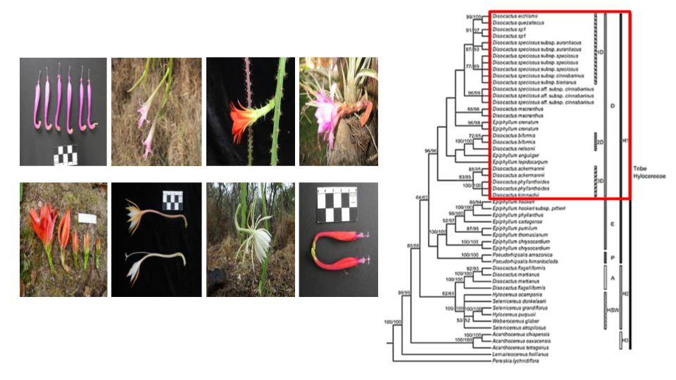
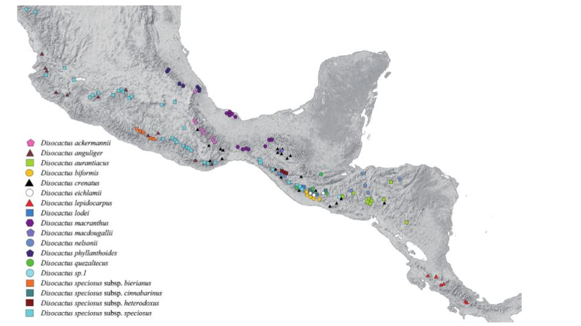
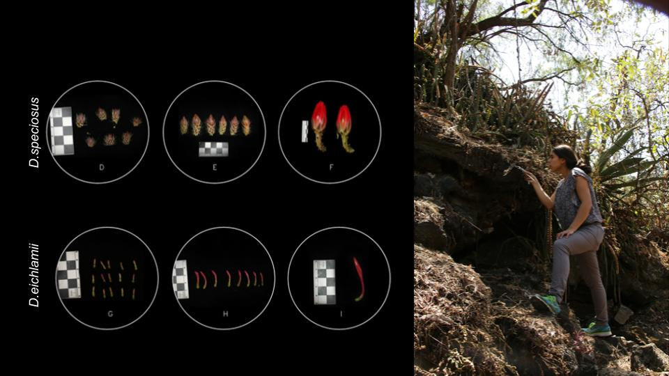
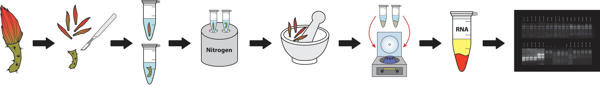
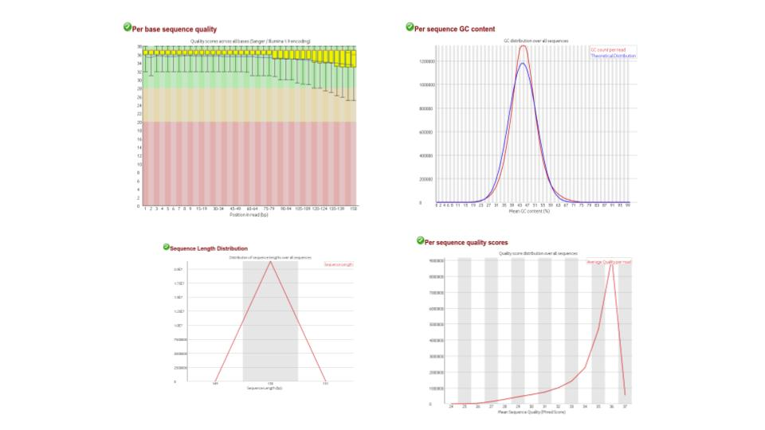
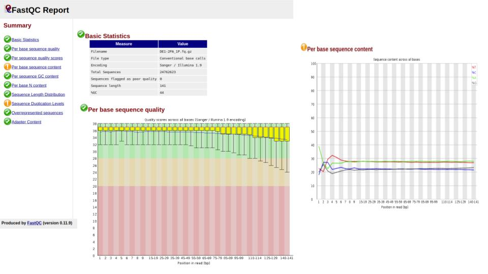
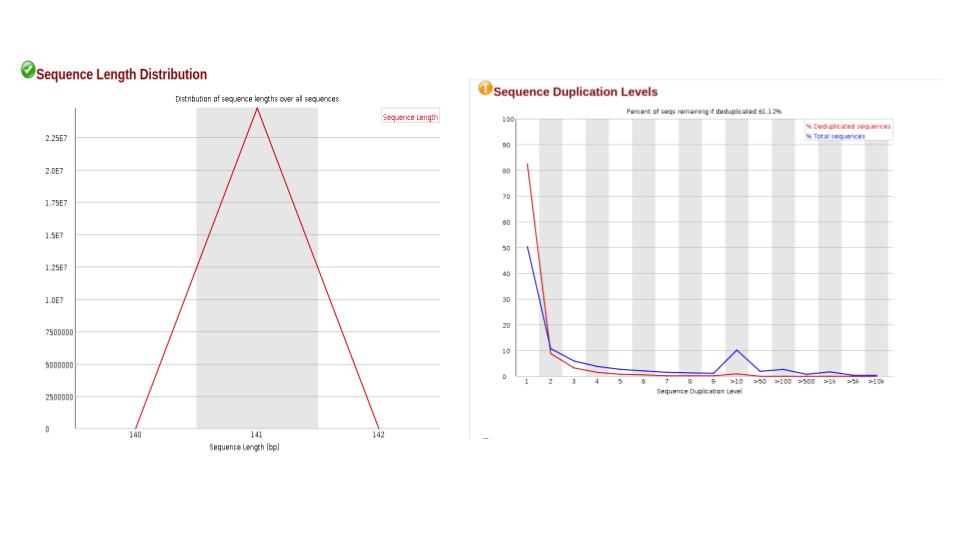
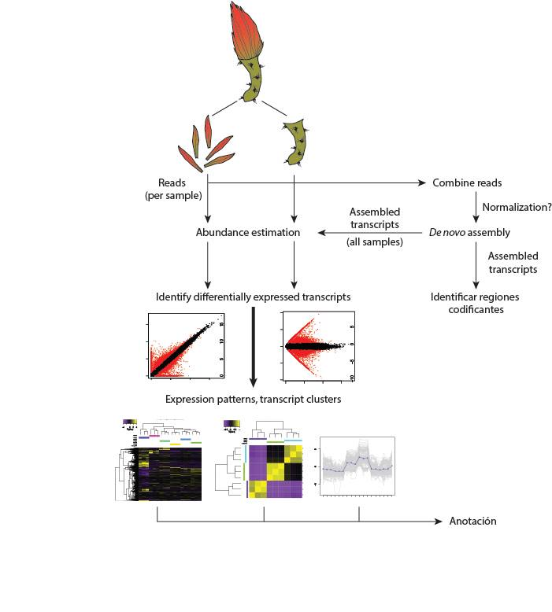

## Comparative transcriptomics of flower development in *Disocactus* species (Hylocereae,Cactaceae)

---

#### Background

*Disocactus* is epifitic and epilitic cacti genus.
The [cDNA phylogenie](https://bioone.org/journals/willdenowia/volume-46/issue-1/wi.46.46112/Molecular-phylogeny-and-taxonomy-of-the-genus-iDisocactus-i-iCactaceae/10.3372/wi.46.46112.full) had shown that *Disocactus* is a monophyletic group in spite of its contrastant floral morphology. *Disocactus* has 13 species distribuited in Mexico and Central America. The principal features in *Disocactus* are flowers with vivid colors and diurnal anthesis. The morphologic diversity in the group can be observed in the size, color, hue, essence, number of periath segments, and shape (actinomorphic or zygomorphyc).




**Fig.1.** Phylogenie of *Disocactus* and flower morphology diversity.




**Fig. 2.** Geographucal distribution of *Disocactus*


---


#### Objective

Identification of genetic expression patterns during flower development in two *Disocactus* species   and its relation with morphologic diversity in the group.

#### Particular objectives


1. *De novo* assambly and annotation of transcriptomes from two Disocactus species.
2. Determined and compare the genetic expression patterns in flower tissue and pericarpel tissue in every developmental stage.
3. Selection of genes involved in flower development for comparative transcriptomic analysis.


---

### Material and methods

___


#### 1. Material colection

Flower buds of three differente developmental stages of *D. speciosus* and *D. eichlamii* were colected from plants of the Epiphytic Cacti Colection of the Botanical garden at UNAM and from Reserva Ecologica del Pedregal de San Ángel.



**Fig. 3**. Material colected for the studie.


##### Table 1. flower sizes colected


| specie/ code 	| stage 1 	| stage 2 	|           stage 3 	|
|-	|-	|-	|-	|
| D. eichlamii/ DE_ 	|   1 cm 	|   2.2 cm 	|  pre anthesis ( 4.6 cm aprox.) 	|
| D. speciosus/ DS_ 	|    1 cm 	|   3 cm 	| pre anthesis (10 cm aprox.) 	|

---

#### 2. RNA extraction and quality assesment


For RNA extraction the flowers were disected separating flower tissue from pericarpel tissue, inmediatly the tissue was conserved in liquid nitrogen. For the RNA extraction [the spectrum plant total RNA kit](https://www.sigmaaldrich.com/catalog/product/SIGMA/STRN50?lang=es&region=MX) was used following the kit instructions. **Note:** Each sample corresponds to a flower.

The RNA quality assessment was performed using [bleach gel](https://www.ncbi.nlm.nih.gov/pmc/articles/PMC3699176/) and Invitrogen Qubit Fluorometric Quantification with the RNA HS assay kit.

The RNA was analyzed using Bioanalyzer at the Beijing Genomic Institute (BGI), in order to evaluate the RNA Integrity Number (RIN). Samples with RIN ⋝ 7 values were sequenced, while samples with RIN ⋜ 7 values had to be repeated.




**Fig. 4.** RNA extraction method and quality assessment.


---

#### 3. Bioinformatic analysis

##### 3.1 Preprocesing data




**Fig. 4.** Preprocesing data using [fastQC](https://www.bioinformatics.babraham.ac.uk/projects/fastqc/).

##### 3.2. Cleaning data

##### [Trimmomatic](http://www.usadellab.org/cms/?page=trimmomatic)

**Parameters:**
1. ILLUMINACLIP:Illumina_adapters.fa:2:30:10:2:keepBothReads
2. HEADCROP:9
3. MINLEN:20

```
#!/bin/bash

# This script is for data cleaning using trimmomatic.
# Run this script from directory ~/bin/  and  the sequences are in ~/data/
# Prerequisites: install trimmomatic 0.39 version

# make out directory for DE data

mkdir -p ../data/DE_clean


# Clean the DE sequences with trimmomatic

for i in `ls ../data/DE | grep ".fq.gz" | sed "s/_1.fq.gz//"| sed "s/_2.fq.gz//" | uniq` ; do
echo ${i}
                     trimmomatic  PE -threads 4 ../data/DE/${i}_1.fq.gz ../data/DE/${i}_2.fq.gz \
                          ../data/DE_clean/${i}_1P.fq.gz  ../data/DE_clean/${i}_2P.fq.gz \
                          ../data/DE_clean/${i}_1U.fq.gz  ../data/DE_clean/${i}_1U.fq.gz \
                          ILLUMINACLIP:../data/DE/Illumina_adapters.fa:2:30:10:2:keepBothReads HEADCROP:9 MINLEN:20
done

```


###### Trimmomatic output





**Fig. 5.** fastQC output


##### 3.3. Corroborate if adapters were eliminated

Using the command grep I tried to corroborate if the adapters from my data were elimated.

I used the next script


````
#!/bin/bash
#Script for check that adapters were removed with trimmomatic

### Path to input
DATA="../data/DE/test_6" ### Path to folder containing gz compressed fastQC files

#check if adapters were removed from sequences using grep in firts 4000000 sequences


for i in `ls $DATA | grep ".fq.gz" | sed "s/_1.fq.gz//"| sed "s/_2.fq.gz//" | uniq` ; do
echo ${i}

cat $DATA/${i} | head -4000000 | grep GATCGGAAGAGCACACGTCTGAACTCCAGTCACATTCCTTTATCTCGTATGCCGTCTTCTGCTTG | wc -l


cat $DATA/${i} | head -4000000 | grep AATGATACGGCGACCACCGAGATCTACACTCTTTCCCTACACGACGCTCTTCCGATCT | wc -l

done


````

---



**Fig. 6**. Trancriptomics *de novo* assambly and analysis workflow. (modified from Haas *et. al*., 2013).

---


##### 3.4. *De novo* assambly


##### [Bridger](https://genomebiology.biomedcentral.com/articles/10.1186/s13059-015-0596-2)

For the *novo assambly* I tried two different programs: [Bridger](https://genomebiology.biomedcentral.com/articles/10.1186/s13059-015-0596-2) and [Trinity](https://github.com/trinityrnaseq/trinityrnaseq/wiki) with different parameters like k-mer sizes. Previous comparissons with my data and the results of both programs showed that with Bridger we obtained a better assambly than with Trinity.

Here I show the script used

````
#!/bin/sh
# This script is for data assambling the transcriptome of D. eichlamii using Bridger.
# Run this script from directory ~/bin/  and  the data is in ~/data/DE/trim/test
# Prerequisites: install Bridger
#bridger comand
#$ -cwd
#$ -j y
#$ -V                    #export environment var
#$ -N bridger_tDE             #name Job
echo "************************************************************"
echo "*********" $HOSTNAME " ****** JOB_ID=" $JOB_ID "  *************"
echo "************************************************************"

SAMPLE="/users-d1/shinojosa/Mammillaria_Illumina/Mammilaria/Trancriptoma/Disocactus"

#bridger assambling

Bridger.pl --seqType fq --left  ${SAMPLE}/data/DE/trim/test/DE_cat_1.fq --right ${SAMPLE}/data/DE/trim/test/DE_cat_2.fq  --output ${SAMPLE}/out/bridger_DE_trim --CPU 30 --clean -k 25


````

### Next steps

Following the [Trinity](https://github.com/trinityrnaseq/trinityrnaseq/wiki) pipeline I will carried out the next analyzes until genes annotation (Fig. 6).
