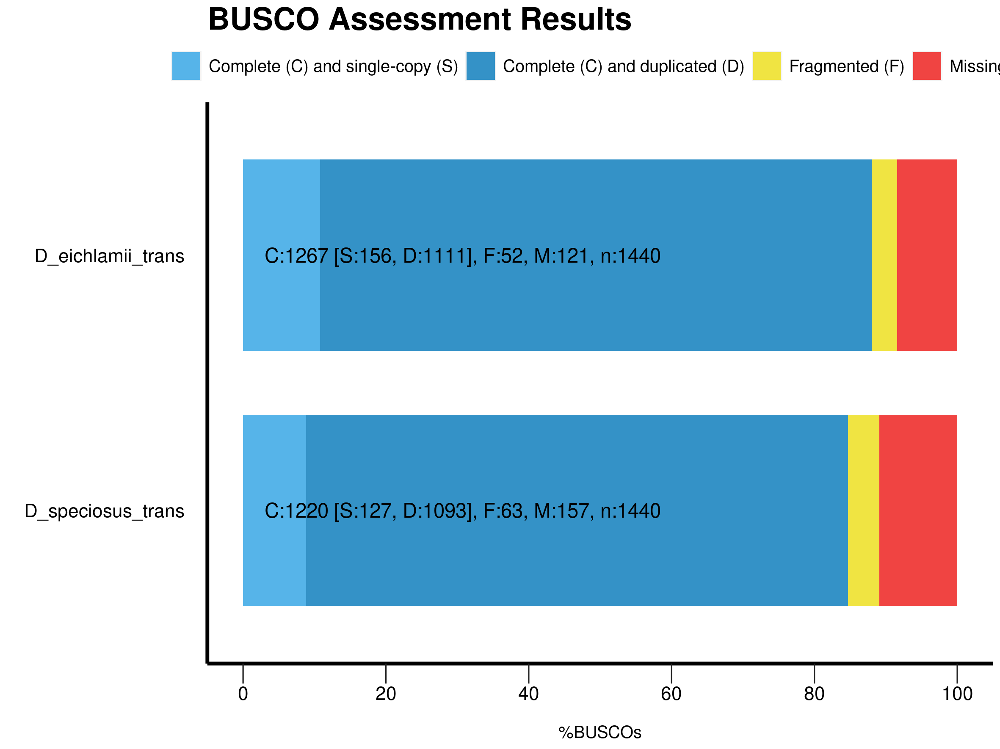

# Comparative transcriptomisc of flower development in *Disocactus* genus (Hyloceareae:Cactaceae)

The flower development has been studied principally in model species like *Arabidosis* and *Anthirrinum* most of the knowlege about the topic comes from those species, but the great diversity present in the Angiosperms made necessary to integrate information and knowlege coming from non model species.

Cactaceae is a popular familly because of it spiny and courios forms, and most of the researches in the family has been focus on taxonomy and stem anatomy. Altougth, flowers in cactaceae studies are important since they has been used to identify species and genus, a little atention has been paid to cacti flower development despite of being a very complex and interesting structure.

Inside the Cactus family, the epipitic cacti represent the 10% of the family, they are popular in gardens and are comun known as "nopalillos". Most of them are distribuited in rain forest of Mexico, central and south america.  Most of the epiphytic cacti ressemble beautifull nocturnal flowers but some genus has diurnal flowers like *Disocactus*.

In order to undestand the flower development in *Disocactus* I am working with two different aproaches: 1) anatomy flower development and 2) transcriptomics, in oder to find some genes or expression clusters which could give us some clues about the flower development in this genus. 

In this summary you will find the progress made transcriptomics objective in the last three moths.

---
 

 ### **RNA-seq and de novo assembly**

 To compare comprehensive gene expression profiles and characterization of the two *Disocactus* species flowers at three stages of development, transcriptome sequencing and analysis were performed. Following the removal of adaptor and low quality sequences, the clean reads were assembled into expressed sequence tag clusters (contigs) and de novo assembled into transcripts using the Trinity in paired-end method, which yielded a total of 148,690 unigenes with an average length of N50 of 2185 bp, and a GC content of 42.12 % *D. eichlamii* while in *D. speciosus* 123,809 unigenes with an average length of N50 of 2162 bp, and GC content of 42.82% (Table 1). Thus, the assembly quality of the transcriptome was satisfactory.

  

 **Table 1.** Assembly quality assessment.

 |species   	    |  N50 	    | E90N50   	| %GC   	| average contig lenght   |
 |---       	    |---	      |---	      |---	    |---                      |
 | D. eichlamii 	|   2184	  |  37176    |   42.12	|  1287.16                |
 | D. speciosus  	|   2162	  |  41613	  |   42.82 | 1252.20                 |

 

 BUSCO software with the embryophyta_odb9 data base was used to conduct completeness analysis of the transcriptome.  (Figure  1).

 
 

**Figure 1.** BUSCO completeness assessment.

---

### **Transcript Quantification and Analysis of Differentially Expressed Genes (DEGs)**

Transcript quantification was performed using kallisto software.Based on the transcript abundance estimates for each of the 36 samples, a matrix of counts and a matrix of normalized expression values were constructed using edgeR package. Analysis of differentially expressed genes (DEGs) was conducted using the edgeR package (Robinson et al., 2010).

DEGs were analyzed separatly for perianth and pericarpel tissues in both species *D. eichlamii* and *D. speciosus*. Differential genes were screened according to the edgeR filter criteria (FDR < 0.05 & logFC > 1 | FDR < 0.05 & logFC < -1). A volcano plots were used to display the screening results.

### DEGs in D. speciosus

To identify DEGs during flower development, we compared transcript levels of each unigene between developmental stages. In total, 36,668 genes were differentially expressed at different stages in *D. speciosus*. In the DS1_PA vs. DS2_PA comparison, 622 DEGs were detected, including 168 that were up-regulated and 454 that were down-regulated. In the DS2_PA vs. DS3_PA comparison, 7627 up-regulated and 5286 down-regulated transcripts were found. In the comparison of DS1_PA vs. DS3_PA, 9031 up-regulated and 7263 down-regulated transcripts were detected. In the comparison of DS1_PC vs. DS2_PC, 8 up-regulated and 11 down-regulated transcripts were revealed. In the DS2_PC vs. DS3_PC, 1200 up-regulated and 979 down-regulated. In the DS1_PC vs. DS3_PC, 2258 transcripts were up-regulated and 2383 down-regulated (Table 2).

In order to know the DEGs expressed between tissues from the same developmental stage. In total 9057 genes were differentially expressed in the different tissues. First, we compare DS1_PA vs. DS1_PC and 25 DEGs were detected, 9 up-regulated and 16 dow-regulated. In the DS2_PA vs. DS2_PC comparison, 976 DEGs were found, 461 up-regulated and 515 dow-regulated. Finally, in the DS3_PA vs. DS3_PC comparison 8056 DEGs were identified, 3180 up-regulated and 4876 down-regulated.

**Table 2.** DEGs identified in the differente comparisons made.

|  comparison 	|  up-regulated 	| down-regulated  	| total  	|
|---	          |---	            |---	              |---	    |
| DS1_PAvsDS2_PA|   168	          |    454            | 622     |
| DS2_PAvsDS3_PA|   7627          |   5286	          | 12913   |
| DS1_PAvsDS3_PA|   9031	        |   7263            | 16294   |
| DS1_PCvsDS2_PC|   8            	|   11	            | 19      |
| DS2_PCvsDS3_PC|   1200	        |  979              | 2179    |
| DS1_PCvsDS3_PC|   2258          |  2383 	          | 4641    |
| DS1_PAvsDS1_PC|   9             | 16  	            | 25      |
| DS2_PAvsDS2_PC|   461	          | 515               | 976     |
| DS3_PAvsDS3_PC|    3180         |   4876	          | 8056    |

**Figure 2** Volcano plot of up-regulated and down-regulated genes in perianth vs. pericarpel of *D. speciosus*. In red are the genes up-regulates and in green are the genes up-regulated.

### DEGs in D. eichlamii

To identify DEGs during flower development in *D. eichlamii*, we compared transcript levels of each unigene between developmental stages. In total, 17,852 genes were differentially expressed at different stages. In the DE1_PA vs. DE2_PA comparison, 873 DEGs were detected, including 231 that were up-regulated and 642 that were down-regulated. In the DE2_PA vs. DE3_PA comparison, 2960 up-regulated and 3390 down-regulated transcripts were found from 6350 genes. In the comparison of DE1_PA vs. DE3_PA, 4357 up-regulated and 5075 down-regulated transcripts were detected. In the comparison of DE1_PC vs. DE2_PC, 284 up-regulated and 418 down-regulated transcripts were revealed. In the DE2_PC vs. DE3_PC, 286 up-regulated and 170 down-regulated. In the DE1_PC vs. DE3_PC, 284 transcripts were up-regulated and 418 down-regulated (Table 3).

In order to know the DEGs expressed between tissues from the same developmental stage, we compare DEGs in the perianth vs. pericarpel corresponding to the same stage of development. In total 7616 genes were differentially expressed in the different tissues. we compare DE1_PA vs. DE1_PC and 454 DEGs were detected, 278 up-regulated and 176 dow-regulated. In the DE2_PA vs. DE2_PC comparison, 1325 DEGs were found, 759 up-regulated and 566 dow-regulated. Finally, in the DE3_PA vs. DE3_PC comparison 5837 DEGs were identified, 3208 up-regulated and 2696 down-regulated.

**Table 3.**

|  comparison 	|  up-regulated 	| down-regulated  	| total  	|
|---	          |---	            |---	              |---	    |
| DE1_PAvsDE2_PA| 231  	          |  642              | 873     |
| DE2_PAvsDE3_PA| 2960            | 3390  	          | 6350    |
| DE1_PAvsDE3_PA| 4357  	        | 5075              | 9432    |
| DE1_PCvsDE2_PC| 5              	|  34 	            | 39      |
| DE2_PCvsDE3_PC| 286  	          |  170              | 456     |
| DE1_PCvsDE3_PC| 284             |  418 	            | 702     |
| DE1_PAvsDE1_PC| 278             | 176  	            | 454     |
| DE2_PAvsDE2_PC| 759  	          |566                | 1325    |
| DE3_PAvsDE3_PC| 3208            | 2629  	          | 5837    |

**Figure 3.** Volcano plot of up-regulated and down-regulated genes in perianth of *D. eichlamii*. In red are the genes up-regulates and in green are the genes up-regulated.

---

### Discussion

The DEGs analysis shown that major number of differential expressed genes are between the 1 vs 3 stage of development in both species and in both tissues. It looks like the pericarpel in the stage 1 vs 2 not present many differences in gene expression indicating that the tissue in both stage of development is similar. The variation in DEGs between perianth and pericarpel is more evident in the stage of development three. while in the firts stage of development it looks like the tissues are not so different.

Finally the gene annotation was made using the Trinotate and TransDecoder programs, and know we are running Blast2GO, so know I will not be able to give a biological sense to my DEGs results in this moment.

