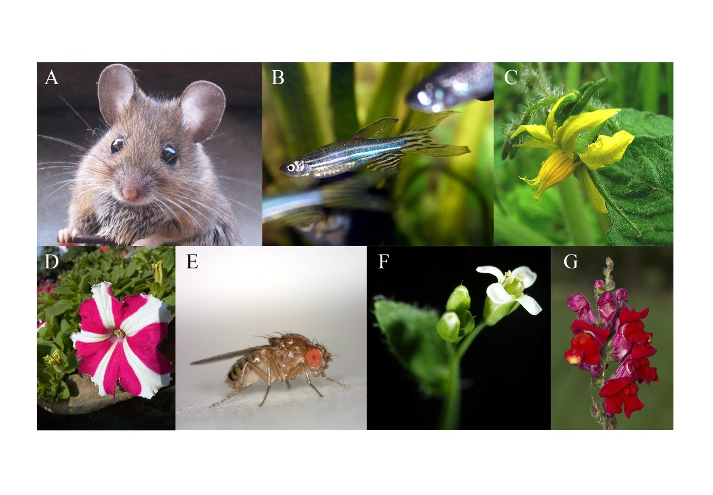
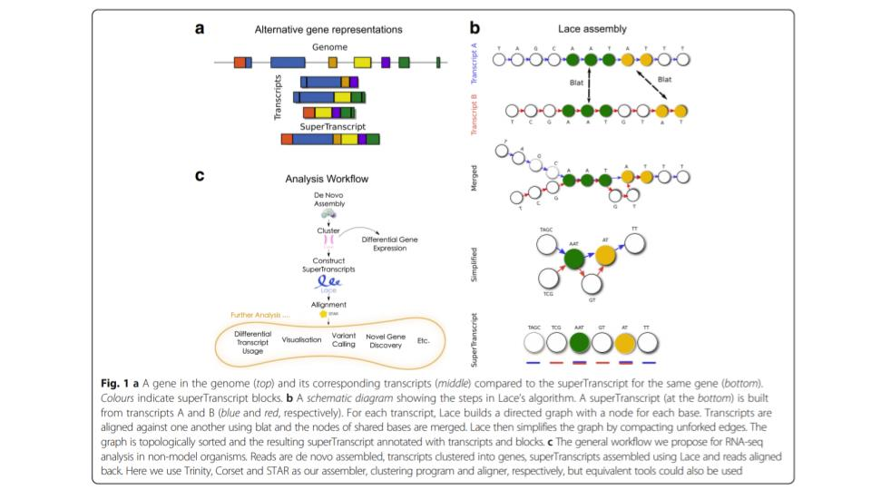
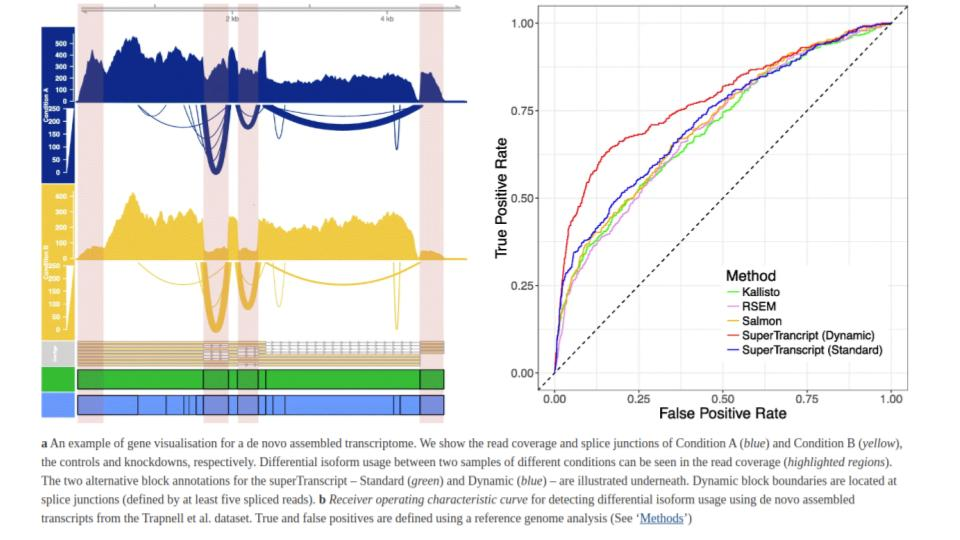
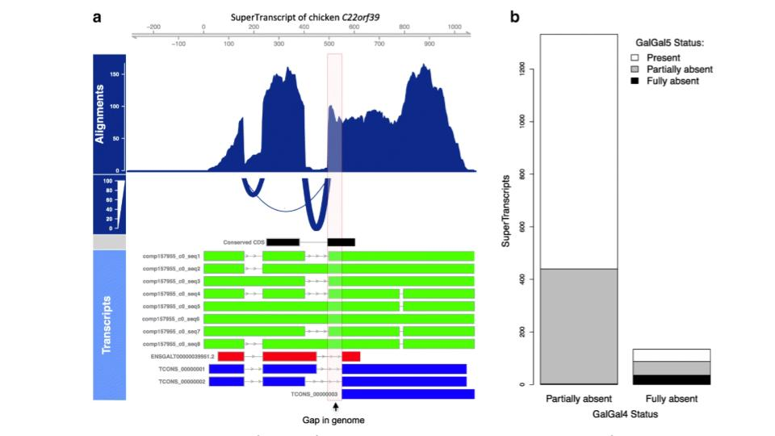

# <span style="color:green">SuperTranscripts: a data driven reference for analysis and visualisation of transcriptomes</span>
by Nadia M. Davidson, Anthony D. K. Hawkins and Alicia Oshlack

<div class=text-justify>

Numerous methods have been developed to analyse RNA sequencing (RNA-seq) data, and we
now have robust and well established methods for RNA-seq data analysis. Most of these methods use the accurate reference genomes and annotations now available for model organisms. But for non model organisms reference genomes are not always available.

In RNA-seq most of the approaches still have been with a reference genome.
</div>

<p align="center">

</p>

<div class=text-justify>

<sub> **Figure 1. Some model species used in RNA-seq data analysis like gene expression**. A) *Mus musculus*. (modified from Rasbak, under licenses [CC BY-SA 3.0](http://creativecommons.org/licenses/by-sa/3.0/). B) *Danio rerio* (Zebra fish, modified from Marrabbio2, under the licenses Public domain). C) *Solanum lycopersicum*. (modified from Serena from Europe, under the licenses [CC BY-SA 2.0](https://creativecommons.org/licenses/by-sa/2.0). D) *Petunia*. (modified from Fir002, under licenses [CC BY-SA 3.0](https://creativecommons.org/licenses/by-sa/3.0/deed.en). E) *Drosophila melanogaster* (modified from Hannah Davis, under licenses [CC BY-SA 4.0](https://creativecommons.org/licenses/by-sa/4.0). E) *Arabidopsis thaliana* (modified from I, Suisetz, under licenses [CC BY-SA 3.0](http://creativecommons.org/licenses/by-sa/3.0/). G) *Antirrhinum majus* ( modified from I, MichaD,  under licenses [CC BY-SA 2.5](https://creativecommons.org/licenses/by-sa/2.5). All images were originaly deposited in [Wikimedia Commons](https://commons.wikimedia.org/).</sub>
</div>

<br>
<br>


Working with cacti RNA-seq represents a challenge, because does not exist genome of thise species. [Cacti genome only exist for columnar cacti like](https://pubmed.ncbi.nlm.nih.gov/29078296/): *Pachycereus plinglei*, *Carnegia gigantea*, *Lophocereus* and *Stenocereus* species distantly related to epiphitic cacti like *Disocactus* genus.


So we do not have a reference genome


<div class=text-justify>

 The authors propose an alternative representation for each gene, which is refered as **<span style="color:purple">SuperTranscripts</span>**. SuperTranscripts contain the sequence of all exons of a gene without redundancy. They can be constructed
from any set of transcripts including *de novo* assemblies using a python program to build them called **<span style="color:green">[Lace](https://github.com/Oshlack/Lace/wiki)</span>** which is an open source program.

superTranscripts do not necessarily represent any true biological molecule, they provide a practical replacement for a reference genome.

The <span style="color:green">Lace</span> algorithm takes two input files:

- 1. A set of transcript:                              sequences in fasta format.
- 2. A text file with the clustering information that groups each transcript into a gene or cluster.

The <span style="color:green">Lace</span> outputs:

- 1. A fasta file of superTranscript sequences.
- 2. A gff file with their annotation.

</div>



<br>
<br>


|  <span style="color:green">Advantages</span>	| <span style="color:green">Disadvantages</span> 	|
|---	|---	|
|  Lace is that it can produce superTranscripts from any combination of transcripts and is compatible with any transcriptome assembler. 	| Lace’s running time is primarily limited by the speed of the BLAT alignments, however, for genes with a large number of transcripts, processing the splicing graph is significantly slower. 	|
|   Accuracy of detecting heterozygous SNPs in non-model organisms using superTranscripts is similar to the detection accuracy of heterozygous SNPs from RNA-seq in model organisms. |  Lace uses only the first 50 transcripts from each gene by default. |   |
	|  SuperTranscripts can be used in a similar way to the reference genome approach where reads are aligned to the superTranscripts instead of a reference genome.  |Constructing superTranscripts for an entire de novo assembly on eight cores takes approximately 0–8 h on a linux cluster and uses up to 4 Gb of RAM,depending on the size of the input transcriptome. |
|   SuperTranscript methods for defining and counting reads resulted in better performance when testing for differential isoform usage. |   |   |
|   Differential isoform usage can be detected in non-model organisms using a count-based approach, rather than inference methods, and result to be more accurate. |   |   |

<br>
<br>


- - - -
## <span style="color:green">Some examples of Lace and superTrancripst applications</span>

### <span style="color:purple">1. Application of Lace and superTranscripts to non-model organisms</span>

 - Detecting variants in non-model organisms


### <span style="color:purple">2. Differential isoform usage in non-model organisms</span>

<p align="center">

</p>


### <span style="color:purple">3. Combining reference and *de novo* assembled transcriptome</span>


![fig]
### <span style="color:purple">4. Using SuperTranscripts in model organisms</span>



- - -


## <span style="color:green">Generate SuperTranscripts througth Trinity</span>


You can generate SuperTranscripts througth [trinity](https://github.com/trinityrnaseq/trinityrnaseq/wiki/SuperTranscripts) using the next command line:

```

$TRINITY_HOME/Analysis/SuperTranscripts/Trinity_gene_splice_modeler.py \
       --trinity_fasta Trinity.fasta

```

<br>
<br>
two output files should be generated:
<br>
<br>

```
trinity_genes.fasta   :supertranscripts in fasta format
trinity_genes.gtf     :transcript structure annotation in gtf format

```
<br>
<br>

If you're interested in capturing a multiple alignment view that contrasts the different candidate splicing isoforms, you can include parameter ```--incl_malign```, and it'll generate a file ```trinity_genes.malign```.


reference:

[SuperTranscripts: a data driven reference
for analysis and visualisation of
transcriptomes](https://genomebiology.biomedcentral.com/articles/10.1186/s13059-017-1284-1)
