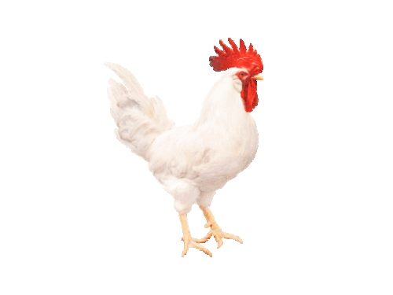

# SuperTranscripts: a data driven reference for analysis and visualisation of transcriptomes
by Nadia M. Davidson, Anthony D. K. Hawkins and Alicia Oshlack
- - -

<div class=text-justify>

RNA sequencing (RNA-seq) can examine expression at the gene level as well as infer
transcript abundances and differential isoform usage. Alternative splicing can alter gene. In
addition, RNA-seq has the power to detect variation in expressed sequence, such as single nucleotide variants, post-transcriptional editing and fusion genes. Now have robust and well established methods for RNA-seq data analysis, but most of these methods use reference genomes and annotations now
available for model organisms.


</div>

<p align="center">

</p>

<div class=text-justify>

<sub> **Figure 1. Some model species used in RNA-seq data analysis like gene expression**. A) *Mus musculus*. (modified from Rasbak, under licenses [CC BY-SA 3.0](http://creativecommons.org/licenses/by-sa/3.0/). B) *Danio rerio* (Zebra fish, modified from Marrabbio2, under the licenses Public domain). C) *Solanum lycopersicum*. (modified from Serena from Europe, under the licenses [CC BY-SA 2.0](https://creativecommons.org/licenses/by-sa/2.0). D) *Petunia*. (modified from Fir002, under licenses [CC BY-SA 3.0](https://creativecommons.org/licenses/by-sa/3.0/deed.en). E) *Drosophila melanogaster* (modified from Hannah Davis, under licenses [CC BY-SA 4.0](https://creativecommons.org/licenses/by-sa/4.0). E) *Arabidopsis thaliana* (modified from I, Suisetz, under licenses [CC BY-SA 3.0](http://creativecommons.org/licenses/by-sa/3.0/). G) *Antirrhinum majus* ( modified from I, MichaD,  under licenses [CC BY-SA 2.5](https://creativecommons.org/licenses/by-sa/2.5). All images were originaly deposited in [Wikimedia Commons](https://commons.wikimedia.org/).</sub>
</div>

- - -

But for non model organisms reference genomes are not always available, and in RNA-seq most of the approaches still have been with a reference genome difficulting the work wiht non-model species.

Working with epiphitic cacti RNA-seq represents a challenge, because does not exist a reference genome of these species. [Cacti genome only exist for columnar's like](https://pubmed.ncbi.nlm.nih.gov/29078296/): *Pachycereus plinglei*, *Carnegia gigantea*, *Lophocereus* and *Stenocereus*. Species distantly related to epiphitic cacti like *Disocactus* genus.

<p align="center">

</p>

<br>


- - -

*De novo* assembly, is a process disegn to rebuild sequences for every expressed transcript. But many downstream analysis required a refercence genome.

For this reason in this article authors propose an alternative representation for each gene, which is refered as **SuperTranscripts**. SuperTranscripts contains all exon sequences of a gene without redundancy and can be constructed from any set of transcrits, even *de novo* assembly.

In spite of superTranscripts do not necessarily represent any true biological molecule, they provide a practical replacement for a reference genome.

**SuperTranscript applications:**

**1.** Reads can be aligned to the superTranscriptome using a splice aware
aligner and subsequently visualised using standard tools
such as [IGV](https://software.broadinstitute.org/software/igv/igvtools).

**2.** Quantification can also be performed with existing software by counting the reads that overlap superTranscript features.

**3.** SuperTranscripts can be used to call variants and accurately detect differential isoforms.

**4.** SuperTranscripts also can be use in model organisms to identificate novel
transcribed sequence.

- - -

### Lace construct superTrancripst

SuperTranscripts can be built from any set of transcripts, including de novo assembled transcripts, using an overlap assembly method. They can be constructed
from any set of transcripts including *de novo* assemblies using a python algorithm to build them called [Lace](https://github.com/Oshlack/Lace/wiki) which is an open source program.

 #### The Lace algorithm takes two input files:

1. A set of transcript: sequences in fasta format. 
2. A text file with the clustering information that groups each transcript into a gene or cluster.

#### The Lace outputs:

1. A fasta file of superTranscript sequences.
2. A gff file with their annotation.

</div>


<br>
<br>

- - -

|  Advantagers 	|  Disadvantages 	|
|---	|---	|
| Lace can produce superTranscripts from any combination of transcripts and is **compatible with any transcriptome assembler**.   	|   Lace’s running time is primarily limited by the speed of the BLAT alignments, however, for genes with a large number of transcripts, processing the splicing graph is significantly **slower**.	|
|  **Accuracy of detecting heterozygous** SNPs in non-model organisms using superTranscripts is similar to the detection accuracy of heterozygous SNPs from RNA-seq in model organisms.  	| Lace uses only the first 50 transcripts from each gene by default.  	|
|   SuperTranscripts can be used in a **similar way to the reference genome** approach where reads are aligned to the superTranscripts instead of a reference genome.	| Constructing superTranscripts for an entire de novo assembly on eight cores **takes approximately 0–8 h** on a linux cluster and uses up to 4 Gb of RAM,depending on the size of the input transcriptome.  |
|  SuperTranscript methods for defining and counting reads resulted in **better performance** when testing for differential isoform usage.  |  |
|   Differential isoform usage can be detected in non-model organisms using a count-based approach, rather than inference methods, and result to be **more accurate**. |   |   |


<br>
<br>


- - - -
## Some examples of Lace and superTrancripst applications

### 1. Application of Lace and superTranscripts to non-model organisms

 - Detecting variants in non-model organisms


### 2. Differential isoform usage in non-model organisms

<p align="center">

</p>

- - -

### 3. Combining reference and *de novo* assembled transcriptome

+ Using the galGal4 (chiken) genome from November 2011.
+ The transcriptome in chicken gonads by using Lace to assemble SuperTranscripts.
+ Four differente transcriptomes.





- - -

### 4. Using SuperTranscripts in model organisms


- - -


## Generate SuperTranscripts througth Trinity


You can generate SuperTranscripts througth [trinity](https://github.com/trinityrnaseq/trinityrnaseq/wiki/SuperTranscripts) using the next command line:

```

$TRINITY_HOME/Analysis/SuperTranscripts/Trinity_gene_splice_modeler.py \
       --trinity_fasta Trinity.fasta

```

<br>
<br>
two output files should be generated:
<br>
<br>

```
trinity_genes.fasta   :supertranscripts in fasta format
trinity_genes.gtf     :transcript structure annotation in gtf format

```
<br>
<br>

If you're interested in capturing a multiple alignment view that contrasts the different candidate splicing isoforms, you can include parameter ```--incl_malign```, and it'll generate a file ```trinity_genes.malign```.


reference:

[SuperTranscripts: a data driven reference
for analysis and visualisation of
transcriptomes](https://genomebiology.biomedcentral.com/articles/10.1186/s13059-017-1284-1)
